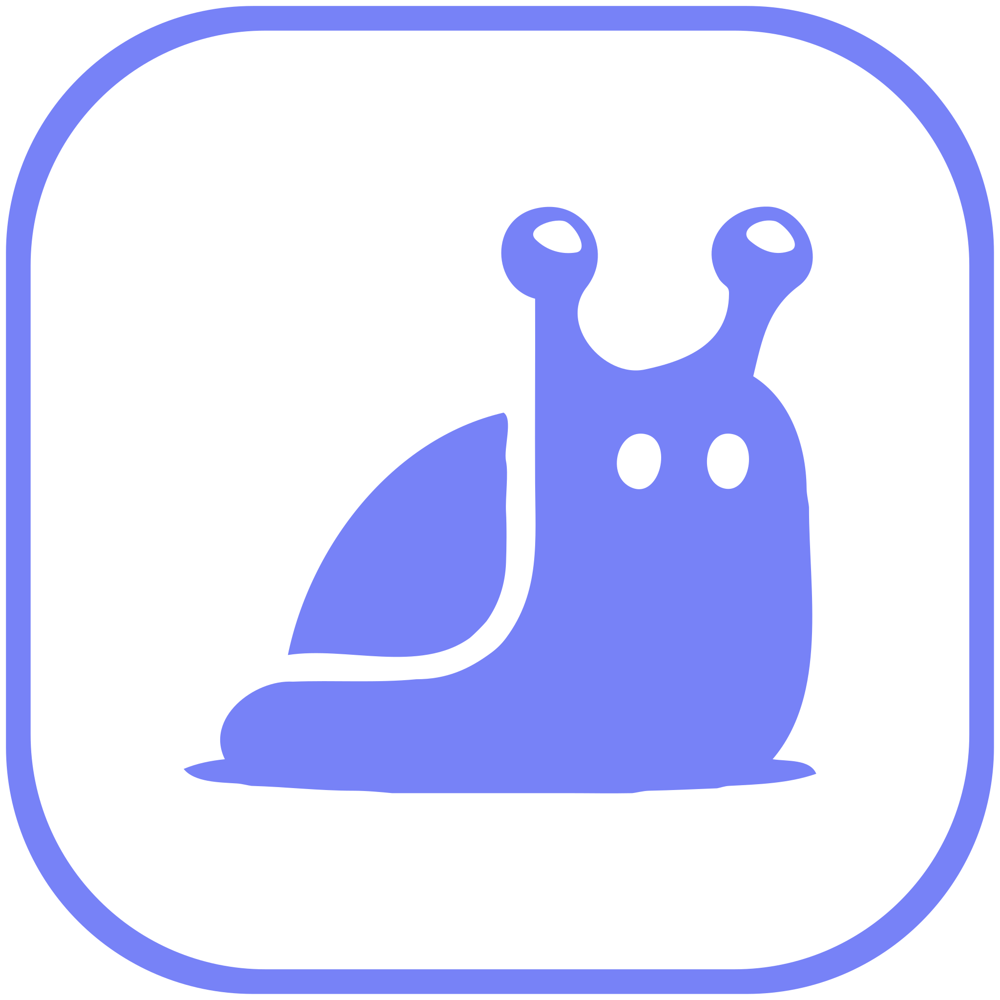

# SlugBase

<p align="center">
  
</p>

<p align="center">
  <a href="https://docs.slugbase.app"></a>
  <a href="https://hub.docker.com/r/mdglabs/slugbase"></a>
  <a href="LICENSE"></a>
  <a href="https://github.com/mdg-labs/slugbase/actions/workflows/docker-build-push.yml"></a>
</p>

**Your links. Your structure. Your language. Your rules.**

SlugBase is an open-source, self-hosted bookmark manager with optional link forwarding. Store and organize your bookmarks, and optionally expose them as personal short redirect URLs.

## Try SlugBase Cloud

Sign up for a free account at **[slugbase.app](https://slugbase.app)** to use the hosted service without installing anything. The free plan lets you explore bookmarks, folders, tags, and link forwarding.

## Self-host with Docker (no clone required)

The published image is **`mdglabs/slugbase`** on [Docker Hub](https://hub.docker.com/r/mdglabs/slugbase). You do **not** need this repository on disk to run it — grab the compose file from the docs and go.

1. Create a directory for your deployment.
2. Add a **`docker-compose.yml`** — copy from **[Install with Docker Compose](https://docs.slugbase.app/selfhosted/docker-compose)** in the docs (full file to paste), **or** after cloning/forking copy **`docker-compose.example.yml`** → **`docker-compose.yml`**.
3. Add an **`.env`** with secrets and URLs — see **[Configuration](https://docs.slugbase.app/selfhosted/configuration)**.
4. Run:

```bash
mkdir -p data
docker compose up -d
```

The compose file pulls **`mdglabs/slugbase:latest`**, maps **`${PORT:-5000}:5000`**, mounts **`./data`** for SQLite, and health-checks **`/api/health`**. To **build the image from this repo** instead, clone the repo and add **`build: .`** to the `slugbase` service (see comments in **`docker-compose.example.yml`**).

More options: **[Docker](https://docs.slugbase.app/selfhosted/docker)** (single container, `Dockerfile.backend`), **[reverse proxy](https://docs.slugbase.app/selfhosted/reverse-proxy)**, **[first run setup](https://docs.slugbase.app/selfhosted/first-run-setup)**.

## Features

### Core

- 📚 **Bookmarks** — Titles, URLs, optional custom slugs
- 🔗 **Link forwarding** — `/go/:slug` redirects and browser custom search (`Ctrl+K` global search)
- 🏷️ **Tags and folders** — Many-to-many organization
- 👥 **Sharing** — Bookmarks and folders with teams and users (where enabled)
- 📥 **Import / export** — JSON and other flows
- 🌐 **i18n** — Multiple languages (see `frontend/src/locales/`)
- 🌓 **Themes** — Dark / light / system
- 🤖 **AI suggestions** — Optional OpenAI-powered title/tag/slug hints (Admin → AI on self-hosted)
- 🔑 **API tokens** — `Authorization: Bearer sb_…` for the REST API

### Authentication and security

- 🔐 **OIDC** — Configurable providers (self-hosted admin)
- 🔑 **Email / password** — Local accounts
- 🛡️ **MFA (TOTP)** — Optional with backup codes — see **[SECURITY.md](./SECURITY.md)**
- 👨‍💼 **Admin** — First user setup; user/team management

### Data and deployment

- 💾 **SQLite** default; 🐘 **PostgreSQL** supported
- 🔄 **Migrations** — Automatic on startup (`backend/src/db/migrations/`)
- 🐳 **Docker** — Multi-stage **`Dockerfile`**; optional **`Dockerfile.backend`** for API-only images
- 📊 **OpenAPI** — **`/openapi.json`**, **`/openapi.yaml`**, Swagger UI at **`/api-docs`** (disable UI with **`SLUGBASE_API_DOCS=false`**)

Operator-focused hosting notes (Fly.io, Neon, etc.) live in the private **[slugbase-docs-internal](https://github.com/mdg-labs/slugbase-docs-internal)** repo.

## Tech stack

| Area | Stack |
| --- | --- |
| ⚛️ Frontend | React, TypeScript, Vite, Tailwind, React Router, i18next, Radix UI, cmdk (command palette) |
| 🖥️ Backend | Node.js, Express, TypeScript, Passport (JWT + OIDC), Zod, SQLite / PostgreSQL |

## Quick start (development)

For **local development** you need a git checkout:

```bash
git clone https://github.com/mdg-labs/slugbase.git   # or your fork
cd slugbase
npm install
npm run dev
```

- Backend: `http://localhost:5000`
- Frontend (Vite): `http://localhost:3000`

On first run with a fresh database, open the app and complete **Initial Setup** (first user becomes admin).

### Production without Docker

```bash
npm run build
npm run start
```

Serves the combined API and built frontend (default port **5000**) via **`apps/selfhosted`**. Configure production **`.env`** first — see **[Configuration](https://docs.slugbase.app/selfhosted/configuration)**.

After **`docker compose up -d`** or **`npm run start`**, visit the app URL and finish setup; use **`/openapi.json`** or **`/api-docs`** for the API.

## Runtime modes: `selfhosted` vs `cloud`

The core codebase supports two build/runtime profiles:

| | **Self-hosted (default)** | **Cloud** |
| --- | --- | --- |
| Mode | No `SLUGBASE_MODE` or `selfhosted` | `SLUGBASE_MODE=cloud` (backend); `VITE_SLUGBASE_MODE=cloud` (frontend build) |
| Auth | Long-lived JWT cookie; OIDC from **Admin** | Short-lived access + refresh cookies; OIDC via env (`OIDC_*`); admin OIDC/SMTP tabs hidden |
| URLs | App at `/` | Marketing at `/`; product often under `/app` (see **slugbase-cloud** deployment) |

SaaS packaging, env matrices, and embedding live in **[slugbase-cloud](https://github.com/mdg-labs/slugbase-cloud)** and **slugbase-docs-internal**. This README focuses on the open-source core.

## Configuration

Environment variables are documented in **[Configuration](https://docs.slugbase.app/selfhosted/configuration)** (URLs, secrets, database, email). Highlights:

- **Database:** `DB_TYPE`, `DB_PATH` (SQLite), or `DATABASE_URL` / `DB_*` (PostgreSQL)
- **Server:** `PORT`, `NODE_ENV`, `SESSION_SECRET`, `BASE_URL`, `FRONTEND_URL`
- **Self-hosted email:** SMTP via **Admin → Settings**
- **AI (self-hosted):** Admin → AI Suggestions (or env where documented for cloud)

## Project structure

npm **workspace** monorepo — commands run from the repository root.

```
slugbase/
├── backend/                 # Express API, auth, DB, migrations, OpenAPI source
├── frontend/                # React SPA (Vite)
├── packages/core/           # Shared package (@mdguggenbichler/slugbase-core)
├── apps/selfhosted/       # Production server: API + static frontend
├── docker-compose.example.yml   # Template: copy to docker-compose.yml (ignored by git)
├── Dockerfile             # Full-stack production image
├── Dockerfile.backend     # Backend-only image
└── package.json           # Workspace root
```

## Documentation

| Audience | Link |
| --- | --- |
| 📖 End users and self-hosters | **[docs.slugbase.app](https://docs.slugbase.app)** |
| 🔧 Operators and cloud integration (private) | **[slugbase-docs-internal](https://github.com/mdg-labs/slugbase-docs-internal)** |

## API

- **OpenAPI 3** — Source: **`backend/openapi/openapi.selfhosted.yaml`**; served at **`/openapi.json`** and **`/openapi.yaml`**
- **Auth** — Session / JWT cookie **`token`**, or **`Authorization: Bearer`** (JWT or **`sb_`** API token)

## Usage examples

**Forwarding:** Save a bookmark with a slug; open `{BASE_URL}/go/{slug}` (login as needed for shared items).

**Custom search:** Use `{BASE_URL}/go/%s` as the search URL with a short keyword (e.g. `go`) — see the in-app **Search engine guide**.

**Sharing:** Edit a bookmark → share → pick teams or users.

## Contributing

We’d love your help — see **[CONTRIBUTING.md](./CONTRIBUTING.md)**.

## Security

See **[SECURITY.md](./SECURITY.md)** (threat model, MFA, reporting).

## License

Released under the **MIT License** — see **[LICENSE](./LICENSE)**.

---

**SlugBase** – Your links. Your structure. Your language. Your rules.
