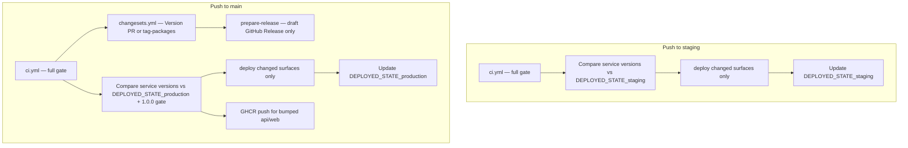

# CI/CD deploy pipeline refactor — proposal

**Status:** Draft (internal) — design only, no implementation yet  
**Date:** 2026-06-24 (updated: production trigger locked)  
**Audience:** Engineering  
**Spec refs:** spec §22.4–22.8, §14.2, §14.7

---

## Goal

Restore a **simple, reliable deploy pipeline** where:

1. **Every deploy runs only after CI passes** (lint, typecheck, unit, build, integration, audit — the full gate).
2. **Deploy decisions use package semver only** — read `version` from each deployable service’s `package.json`, compare to what is already deployed, deploy when the version is **higher**.
3. **No path-based or Turbo-affected detection** — no `git diff` file lists, no `turbo run build --dry-run=json --filter=...[REF]`, no “shared lib changed → redeploy everything” heuristics.
4. **Fewer moving parts** — collapse the current shell-script + workflow indirection into a small, testable core and inline workflow steps where that is clearer.
5. **Operator control** — `workflow_dispatch` can deploy one service or the full stack to staging or production, including pinned versions / GHCR image rollback, still behind CI on the chosen ref.

---

## What we want (target behaviour)

### Deployable surfaces

| Surface | Package | `package.json` path |
|---|---|---|
| API (+ DB migrate) | `@slugbase/backend` | `packages/backend/package.json` |
| Web | `@slugbase/web` | `packages/web/package.json` |
| Marketing | `@slugbase/marketing` | `packages/marketing/package.json` |
| Admin (+ admin DB migrate) | `@slugbase/admin` | `packages/admin/package.json` |

Shared libraries (`shared-types`, `ui`, `email-templates`, `db-admin`) are **not** deploy targets. They ship inside whichever service image/worker is built when that service’s version bumps.

### CI gate (unchanged intent, enforced everywhere)

| Trigger | CI | Deploy |
|---|---|---|
| PR → `staging` | Yes (`pr.yml` → `ci.yml`) | No |
| Push → `staging` | Yes | Yes — **staging** |
| Push → `main` | Yes | Yes — **production** |

Production deploy must **not** bypass CI. Today `release.yml` runs on `release: published` with **no CI job** — that violates the goal and will be removed.

### Production trigger — **locked decision**

**Deploy production on `push` → `main` after CI passes.** Do **not** use `release: published` as a deploy gate.

| Approach | Verdict |
|---|---|
| Deploy on `release: published` (today) | **Reject** — no CI, manual publish step, aggregate `release-YYYY-MM-DD` tag is a poor deploy identity for per-service versions |
| Auto-publish draft release, then deploy on release | **Reject** — still couples deploy to GitHub Release machinery |
| **Deploy on `push` → `main` when service version > `DEPLOYED_STATE_production`** | **Adopt** — one workflow run per merge, selective per-surface deploy jobs |

**Why this fits independent service versions:**

- A Changesets Version PR can bump one or more packages in a **single** merge → **one** `main` push → **one** deploy workflow → plan deploys only surfaces whose semver increased (not four separate production runs).
- `changeset tag` already creates per-package git tags (`@slugbase/backend@1.0.2`) for audit and rollback — those are refs, not deploy triggers.
- `DEPLOYED_STATE_production` is the source of truth for what is live per surface; GitHub Releases are not.

**GitHub Releases (decoupled from deploy):** see [GitHub Releases & tags — recommended workflow](#github-releases--tags--recommended-workflow) below.

**Human approval before production (if needed):** use GitHub Environment protection rules on the production deploy job (`environment: production` — required reviewers, wait timer, `main`-only deployment branches). Do not use “click Publish on draft release” as the approval gate.

#### `main.yml` target job graph

```text
push main
  ├─ ci                    (full gate — required)
  ├─ changesets            (needs ci — Version PR or tag-packages on publish)
  ├─ prepare-release       (needs changesets, if published — draft only, no deploy dependency)
  └─ deploy-production     (needs ci — same SHA; version plan vs DEPLOYED_STATE_production)
       └─ GHCR push        (same plan outputs as deploy jobs)
```

`prepare-release` and `deploy-production` may run **in parallel** after their respective `needs` pass — deploy does not wait for the draft release.

### Version-based deploy rule (single rule for both environments)

For each deployable surface `S` with package version `V_current`:

```
deploy(S) = semver_gt(V_current, V_deployed[S])
```

- `V_deployed[S]` comes from the repo variable `DEPLOYED_STATE_{environment}` — JSON map per surface, e.g. `{ "api": { "version": "0.1.1", "sha": "abc1234" }, ... }`.
- If `DEPLOYED_STATE` is missing or invalid for an environment → **first-run bootstrap**: deploy all surfaces whose version check would pass (staging: all bumped; production: only those ≥ `1.0.0`).
- **No other inputs** to the deploy decision (no changed paths, no turbo graph, no lockfile-only rules).

#### Staging (`push` → `staging`)

After CI succeeds:

1. Read the four service versions from the commit being deployed.
2. Compare each to `DEPLOYED_STATE_staging`.
3. Deploy only surfaces where `V_current > V_deployed`.
4. Run `sync-secrets` only for surfaces being deployed.
5. Run migrations only when API or admin is deploying.
6. On successful smoke → update `DEPLOYED_STATE_staging` for deployed surfaces.

#### Production (`push` → `main`)

Triggered automatically on every `main` push (including Version PR merges). **Not** triggered by `release: published`.

After CI succeeds:

1. Read service versions from the pushed commit’s `package.json` files.
2. Same version comparison against `DEPLOYED_STATE_production`.
3. **Additional gate:** a surface deploys only if `V_current >= 1.0.0` **and** `V_current > V_deployed`.
4. Surfaces still on `0.x` are skipped with a clear log reason (not a silent failure).
5. GHCR image push (`:semver` + `:latest`) follows the same version bump — push API image when `@slugbase/backend` version increased; push web image when `@slugbase/web` increased.

**Example:** Version PR merges with `backend@1.0.2` and `web@1.0.1` bumped → one `main` push → one deploy workflow → `deploy_api` + `deploy_web` jobs run; marketing and admin skipped.

### What explicitly does **not** gate deploys

- Changed files under `packages/shared-types/`, `packages/ui/`, etc. without a service version bump → **no deploy** (Changesets / manual version bump is the release signal).
- Root `package.json` version, `pnpm-lock.yaml`, `turbo.json`, `.github/workflows/*` → **no deploy** unless a service `package.json` version also increased.
- Dockerfile / fly.toml / wrangler config edits → **no deploy** unless the owning service version increased (infra-only fixes ship with the next intentional version bump).

This is intentional: **version bump is the release lever**. Operators bump the service they changed; CI + deploy follow.

### GitHub Releases & tags — recommended workflow

**Constraint:** one GitHub Release is bound to **exactly one git tag**. You cannot attach `@slugbase/backend@1.0.2` and `@slugbase/web@1.0.1` to a single Release object.

That is normal for monorepos. The community pattern is **two layers** — not “one tag to rule them all” and not “one GitHub Release per service” for a product announcement.

#### Two-layer tag model (locked)

| Layer | Mechanism | Purpose | Consumer |
|---|---|---|---|
| **Technical (per service)** | `changeset tag` → git tags like `@slugbase/backend@1.0.2` | Rollback ref, manual `workflow_dispatch` `git_ref`, audit trail | Engineering, CI, ops |
| **Comms (per ship batch)** | `prepare-release` → one GitHub Release on `release-YYYY-MM-DD` | Single announcement when a Version PR lands; combined release notes | Humans, GitHub watchers, CE operators scanning Releases |

Keep `createGithubReleases: false` on `changesets/action` (already set). Per-package **git tags** still exist; per-package **GitHub Releases** do not.

#### Why not one GitHub Release per service?

`changesets/action` with `createGithubReleases: true` (default) creates **one GitHub Release per published package**. That is best practice for **npm libraries** where consumers subscribe to individual packages. It is a poor fit for **SlugBase as one product** with four deployables:

- One Version PR bumping backend + web → **two** Release notifications, duplicate tarballs of the same repo, noisy Releases tab ([changesets#683](https://github.com/changesets/changesets/issues/683), [action#505](https://github.com/changesets/action/issues/505)).
- No clean “what shipped this week?” story without reading multiple entries.

The Changesets ecosystem is moving toward **`createGithubReleases: aggregate`** ([action#193](https://github.com/changesets/action/pull/193)) for exactly this case. SlugBase’s `create-draft-release.mjs` is the same idea until that ships upstream.

#### Why not only per-service tags (no aggregate Release)?

Technically sufficient for deploy/rollback, but weak for **release announces**: followers get no single entry; there is no default place to read “everything in this batch.”

#### CE / operator scope — **backend + web only** (locked)

For external audiences (CE operators, GHCR image consumers, “what’s running?”), only **API** (`@slugbase/backend`) and **Web** (`@slugbase/web`) belong in the GitHub Release. Marketing and admin deploy on their own cadence; their changelogs stay in-repo (`packages/marketing/CHANGELOG.md`, `packages/admin/CHANGELOG.md`) but **do not** drive GitHub Releases.

#### Release content shape

Each aggregate release is a **product snapshot**, not a dump of every bumped package in the Version PR:

| Field | Content |
|---|---|
| **Title** | `SlugBase API {backendVersion} · Web {webVersion}` — always both current versions from `package.json` at the release commit, even if only one bumped |
| **Tag** | `release-YYYY-MM-DD` (or `-2` suffix on collision) — batch id, not a single-service semver |
| **Body intro** | One line: current API + Web versions (same as title) |
| **Body sections** | `CHANGELOG.md` excerpts **only** for backend and/or web **if that package was in this Version PR’s `published-packages`** |
| **Skip entirely** | Version PR bumps only marketing and/or admin → no GitHub Release |

Example — backend-only bump to `1.0.2`, web still `1.0.1`:

```markdown
SlugBase API 1.0.2 · Web 1.0.1

## API @slugbase/backend@1.0.2
…changelog…

(Web unchanged at 1.0.1 — no section, or a single “Web: no changes in this release” line.)
```

#### How to trigger `prepare-release` (locked)

**Not on every `main` push** — only when a **customer-facing** version ship happened.

```text
push main
  → ci
  → changesets (Version PR merge → published=true + published-packages JSON)
  → deploy-production (semver vs DEPLOYED_STATE; may deploy api and/or web)
  → prepare-release   ← only when gate below passes
```

**Gate (recommended):** run `prepare-release` when **production deploy succeeded** for API and/or Web:

```yaml
prepare-release:
  needs: [changesets, deploy-production]
  if: >
    needs.changesets.outputs.published == 'true' &&
    needs.deploy-production.result == 'success' &&
    (
      needs.deploy-production.outputs.deployed_api == 'true' ||
      needs.deploy-production.outputs.deployed_web == 'true'
    )
```

`deploy-production` must expose `deployed_api` / `deployed_web` (true when that surface was in the plan **and** deploy + smoke succeeded). This ties the GitHub Release to **what actually landed in production**, not merely “a changeset existed.”

**Simpler alternative (already close to today’s `main.yml`):** gate only on Changesets publish + customer packages in the batch:

```yaml
if: >
  needs.changesets.outputs.published == 'true' &&
  contains(join(fromJson(needs.changesets.outputs.published-packages), ','), '@slugbase/backend')
  || contains(..., '@slugbase/web')
```

Use this if you want the draft created **in parallel** with deploy (faster comms prep). Prefer the **deploy-success** gate if CE operators must never see a release notes draft before prod is live.

**Do not trigger on:**

| Event | Release? |
|---|---|
| `main` push with no Version PR / `published=false` | No |
| Version PR bumps only marketing or admin | No |
| Backend/web version bump but production deploy failed | No (deploy-success gate) |

#### `create-draft-release.mjs` changes (implementation)

1. Filter `published-packages` to `@slugbase/backend` and `@slugbase/web` only.
2. If filter is empty → exit 0 (skip release).
3. Read **current** `packages/backend/package.json` and `packages/web/package.json` versions for title + intro (always both).
4. Pull changelog sections only for packages present in the filtered published list.
5. Keep draft + `release-YYYY-MM-DD` tag behaviour.

#### Recommended workflow (locked)

```text
Version PR merges to main (backend and/or web bumped)
  1. changeset tag     → per-package git tags (all bumped packages, including admin/marketing)
  2. deploy-production → api/web/marketing/admin per semver plan
  3. prepare-release   → IF api or web deployed successfully:
                           ONE draft GitHub Release (backend + web snapshot + changelogs)
  4. Operator optionally publishes draft → comms only
```

**Per-service detail** for all four packages remains in `packages/<service>/CHANGELOG.md`. GitHub Releases are the **CE-facing slice** (API + Web only).

#### What each artifact is *not*

| Artifact | Not used for |
|---|---|
| Aggregate `release-YYYY-MM-DD` tag | Deploy gating, per-service version identity, GHCR tags |
| Per-package git tag | Product marketing version; must not require four GitHub Releases |
| Root `package.json` version | Any release or deploy decision |
| GitHub Release publish event | Triggering production deploy |

#### Optional enhancements (not required for refactor)

| Enhancement | When |
|---|---|
| Auto-publish draft (skip manual click) | Team wants Releases tab always current; still comms-only |
| Replace `create-draft-release.mjs` with `createGithubReleases: aggregate` | When changesets/action merges upstream aggregate mode |
| Docs/marketing “What’s new” page | Pull from per-package CHANGELOGs or aggregate Release body |
| Root `CHANGELOG.md` generated from aggregate | Only if a single file is needed for non-GitHub consumers |

**Do not** add per-service GitHub Releases unless SlugBase starts shipping **independently subscribed npm products** — that is a different audience than Cloud/CE deployables.

---

## What is broken today

### 1. Turbo runs without a workspace install (deployment deadlocks / silent skips)

`detect-deploy-targets.sh` invokes:

```bash
pnpm exec turbo run build --dry-run=json --filter=...[BASE_REF]
```

via `scripts/with-ci-env.sh`, but the **detect jobs** in `staging.yml`, `deploy.yml`, and `release.yml` only `actions/checkout` — they never run `.github/actions/setup` (pnpm install). Turbo is not available in `node_modules`; the call fails, `collectAffectedPackages()` returns `[]`, and deploy targets fall through to path rules or end up empty.

**Symptom:** pushes that should deploy nothing do nothing; pushes that should deploy something often do nothing too; `force_full_deploy` and missing `DEPLOYED_STATE` mask the bug intermittently.

### 2. Fragile multi-signal detection

`scripts/detect-deploy-targets.mjs` merges three independent signals:

| Signal | Mechanism | Problem |
|---|---|---|
| Turbo affected packages | `--filter=...[BASE_REF]` | Needs install + valid base ref; breaks on shallow checkout, first push, force-push |
| Git changed paths | `git diff --name-only` | Duplicates turbo; special-cases lockfile/workflows → full redeploy |
| Production idempotency | `DEPLOYED_STATE` + SHA match | Correct idea, but applied **after** turbo/path noise |

Path rules (`PATH_RULES`) and `PACKAGE_TARGET_MAP` for shared libs mean a lockfile or workflow edit can force a **full** redeploy even when no service version changed — the opposite of the desired model.

### 3. Production deploy bypasses CI

`release.yml` triggers on `release: published` and calls `deploy.yml` directly — **no `ci.yml`**. A broken tag can reach production without lint/tests.

### 4. Production trigger does not match the locked model

**Locked:** **push to `main`** → CI → version compare → production deploy.

**Current:** `main.yml` runs CI + Changesets only; production deploy is on **GitHub Release publish** (`release.yml`). That splits “code landed on main” from “deploy ran”, requires a manual publish step, and does not align with per-service semver + `DEPLOYED_STATE`.

### 5. Too many shell wrappers in `.github/scripts/`

There are ~20 bash scripts under `.github/scripts/`, many one-liner wrappers around Node (`detect-deploy-targets.sh` → inline heredoc → `scripts/detect-deploy-targets.mjs`). This pattern:

- Hides logic from workflow YAML (hard to read the pipeline in one place).
- Duplicates checkout/env wiring in every job.
- Splits testable logic (`scripts/*.mjs` + `*.spec.ts`) from untested bash glue.
- Is not idiomatic GHA — composite actions + workflow steps + a **small** set of repo scripts is the usual pattern.

Keep: platform-specific scripts that truly need bash (`sync-secrets.sh`, `flyctl`/`wrangler` wrappers). Collapse or inline the rest.

### 6. `version-check.yml` contradicts per-package versioning

`version-check.yml` still requires **every** workspace `package.json` to match the **root** version. Granular deployment introduced independent service versions (`backend` `0.1.1`, `shared-types` `0.0.0`, etc.). This check is either dead, failing, or blocking the model we want.

### 7. `DEPLOYED_STATE` bootstrap forces full deploy

When `DEPLOYED_STATE` is missing, detect forces `force_full_deploy=true`. Combined with broken turbo detection, this creates unpredictable “deploy everything” vs “deploy nothing” behaviour.

---

## Proposed architecture (simplified)



### One deploy decision function

Replace `detect-deploy-targets.mjs` + `check-production-deploy-needed.mjs` + bash wrapper with a **single** module, e.g. `scripts/resolve-deploy-plan.mjs`:

**Inputs:**

- `environment`: `staging` | `production`
- `deployMode`: `auto` | `manual` (default `auto`)
- `packageVersions`: `{ "@slugbase/backend": "0.1.2", ... }` (read from checkout at `git_ref` — plain `fs`, no turbo)
- `deployedStateJson`: from `vars.DEPLOYED_STATE_{environment}`
- `minProductionVersion`: `1.0.0` (production only)
- `manualServices`: list of surfaces (manual mode only)
- `versionOverrides`: optional per-surface version pins (manual / rollback)
- `imageSource`: `build` | `registry` (manual API/web GHCR rollback)

**Outputs:**

- `deploy_api`, `deploy_web`, `deploy_marketing`, `deploy_admin`
- `run_migrate`, `run_migrate_admin`
- `push_ghcr_api`, `push_ghcr_web`
- `sync_services` (derived list for `sync-secrets.yml`)
- `skip_reasons[]` (for job summary)

**Delete:** `PATH_RULES`, `PACKAGE_TARGET_MAP` turbo path, `collectAffectedPackages`, `collectChangedPaths`.

Unit tests already exist for parts of this (`detect-deploy-targets.spec.ts`, etc.) — rewrite tests against the simplified function.

### Workflows (target file layout)

| File | Role |
|---|---|
| `staging.yml` | `push` + `workflow_dispatch` → `ci` → `deploy` (staging) + GHCR dev push |
| `main.yml` | `push` + `workflow_dispatch` → `ci` → `changesets` → `deploy` (production, needs ci) + `prepare-release` (draft only) + GHCR semver push |
| `deploy.yml` | Reusable; accepts `git_ref`, `deploy_mode`, `services`, version overrides, `image_source` |
| `ci.yml` | Reusable CI gate (unchanged structure) |
| `deploy.yml` (cont.) | Chain: `plan` → `sync-secrets` → migrate → deploy jobs → smoke → `DEPLOYED_STATE` |
| `pr.yml` | CI only |
| `sync-secrets.yml` | Keep as reusable workflow |

**Remove or merge:**

- **`release.yml`** — delete as deploy entry point. Production deploy lives in `main.yml` (`needs: [ci]`). GitHub Releases remain changelog-only via `prepare-release.yml`.
- Duplicate `detect-ghcr-targets` jobs in `staging.yml` / `release.yml` — GHCR push predicates come from the same `plan` job outputs as Fly/CF deploys.

### `DEPLOYED_STATE` (keep, simplify semantics)

Keep repo variables `DEPLOYED_STATE_staging` and `DEPLOYED_STATE_production`. Each surface stores `{ version, sha }` after successful smoke.

**Version compare is the deploy gate.** SHA match is useful for logging and idempotency (“re-run workflow on same commit”) but must **not** be a second conflicting gate — if version is unchanged, skip; if version bumped, deploy even when SHA differs.

### Automatic vs manual deploy modes

| Mode | Trigger | Plan logic |
|---|---|---|
| **Automatic** (default) | `push` to `staging` / `main` | Semver compare vs `DEPLOYED_STATE` (rules above) |
| **Manual** | `workflow_dispatch` on deploy workflow | Operator-selected surfaces, ref, and optional target versions — **no path/turbo detection** |

Automatic pushes never deploy on path changes alone. Manual dispatches never need a version *increase* — they are how operators redeploy or roll back on purpose.

### Manual deploy (`workflow_dispatch`)

Operators must be able to deploy from the GitHub Actions UI (or `gh workflow run`) to **staging** and **production** without editing workflow YAML.

**Still gated by CI:** manual deploy runs the full `ci.yml` gate on the **selected git ref** before any deploy job. Emergency bypass is out of scope for v1 — if CI on the rollback commit fails, fix the commit or use a tag that already passed CI when it shipped.

#### Inputs (staging + production deploy workflows)

| Input | Type | Purpose |
|---|---|---|
| `git_ref` | string | Branch, tag, or SHA to build/deploy from (e.g. `staging`, `main`, `v1.2.0`, `abc1234`). Default: branch head (`staging` or `main`). |
| `deploy_mode` | choice | `auto` — same semver rules as push; `manual` — use `services` + optional version overrides below. |
| `services` | multiselect | `api`, `web`, `marketing`, `admin`, or `all` (whole stack). Ignored when `deploy_mode=auto`. |
| `api_version` | string (optional) | Pin API deploy label / image tag (e.g. `1.0.3`). Empty → read `packages/backend/package.json` at `git_ref`. |
| `web_version` | string (optional) | Pin web (and GHCR web tag when pushing). |
| `marketing_version` | string (optional) | Pin marketing. |
| `admin_version` | string (optional) | Pin admin. |
| `image_source` | choice | `build` (default) — build from `git_ref`; `registry` — deploy pre-built GHCR image at `:<version>` (API/web CE images only). |

`deploy_mode=manual` + `services=all` replaces today’s `force_full_deploy` boolean with an explicit, auditable choice.

#### Manual plan rules

When `deploy_mode=manual`:

1. **Selected surfaces deploy** regardless of whether semver increased vs `DEPLOYED_STATE`.
2. **Version labels** for Sentry, smoke summaries, and `DEPLOYED_STATE` use explicit `*_version` inputs when set; otherwise the version from `package.json` at `git_ref`.
3. **Production ≥ `1.0.0` gate** still applies unless the operator sets an explicit pin ≥ `1.0.0` (rollback to `0.x` on production is blocked by design).
4. **Migrations** run when `api` or `admin` is in the selected set (same as automatic).
5. **`sync-secrets`** runs only for selected surfaces.
6. On success, **`DEPLOYED_STATE` is updated** to the deployed version + SHA — including rollbacks (state reflects what is *live*, not “highest ever”).

When `deploy_mode=auto` on `workflow_dispatch`, behaviour matches a normal push (useful to re-run a skipped deploy after fixing `DEPLOYED_STATE` without a new commit).

#### Single service vs whole stack

| `services` | Deploys |
|---|---|
| `api` | Fly API + migrate + `push_ghcr_api` if selected in GHCR job |
| `web` | CF web worker + `push_ghcr_web` if applicable |
| `marketing` | CF marketing worker |
| `admin` | Fly admin + admin migrate |
| `all` | All four surfaces (respecting production `1.0.0` gate per package) |

Jobs not in the selection are skipped; smoke runs only for deployed surfaces.

#### Rollback (future-facing, supported by manual mode)

Rollback is **not** a separate code path — it is manual deploy with an older `git_ref` and/or `registry` image tag:

| Scenario | Typical inputs |
|---|---|
| Redeploy last good **commit** on staging | `git_ref=<sha>`, `services=api`, `deploy_mode=manual` |
| Roll back API to **published semver** (CE / GHCR) | `image_source=registry`, `api_version=1.0.2`, `services=api`, `git_ref` = tag or branch that matches (for migrate compatibility) |
| Roll back web worker | `git_ref` at release tag + `services=web` + optional `web_version` |
| Full stack rollback | `services=all`, `git_ref=<known-good tag>` |

**Registry rollback (API/web):** when `image_source=registry`, deploy job pulls `ghcr.io/<repo>-api:<api_version>` (or web) instead of building from source. Tag must already exist from a prior successful push. Fly deploy uses that image digest.

**Forward-only migrations:** rolling back *application* code does not auto-reverse DB migrations. Doc/runbook should warn: API/admin rollback may require a forward fix migration if schema drifted. Manual migrate-only workflow is a possible fast-follow — not in initial refactor scope.

#### Resolver changes for manual mode

Extend `resolve-deploy-plan.mjs` inputs:

```text
deployMode:       'auto' | 'manual'
manualServices:   ('api' | 'web' | 'marketing' | 'admin')[]
versionOverrides: { api?: string, web?: string, marketing?: string, admin?: string }
imageSource:      'build' | 'registry'
```

Automatic path unchanged. Manual path sets deploy flags directly from `manualServices` and attaches resolved versions for downstream jobs.

#### Audit / safety

- Job summary lists: mode, `git_ref`, selected services, resolved versions, `image_source`.
- Manual production runs use the `production` GHA environment (approval rules unchanged).
- `DEPLOYED_STATE` after rollback shows the rolled-back version so the next automatic push only deploys if semver increases again.

### First-run bootstrap (operator only)

| Condition | Behaviour |
|---|---|
| Missing / invalid `DEPLOYED_STATE` on automatic push | Deploy all surfaces that pass environment gates (production: ≥ `1.0.0` only), then write state |

No other “smart” detection on automatic pushes.

---

## Script & action layout — **locked decision**

### Principle

1. **Minimize scripts outside workflow YAML** — prefer composite actions and inline `run:` for short, obvious steps.
2. **One canonical directory** for all CI/deploy automation: **`scripts/ci/`**. Delete **`.github/scripts/`** after migration.
3. **No split-brain** — today logic lives in `scripts/*.mjs` while workflows call `.github/scripts/*.sh` wrappers that re-import those modules. That layer is removed; workflows call `scripts/ci/` directly.
4. **Bash only for platform CLIs** — flyctl, wrangler, docker, `gh` orchestration. **Node (`.mjs` / `.ts`)** for deploy planning, state, releases, validation — with Vitest tests beside repo `scripts/`.
5. **`.github/` holds workflows and composite actions only** — not a second scripts tree.

### Directory layout (target)

| Path | Role |
|---|---|
| `.github/workflows/*.yml` | Orchestration only — `uses:`, `needs:`, `if:`, short `run:` |
| `.github/actions/setup/` | Composite: checkout, pnpm, node (existing) |
| `.github/actions/*` | Optional future composites (e.g. fly-deploy) if a step sequence repeats 3+ times |
| `scripts/ci/` | **All** GHA-invoked deploy, sync, smoke, migrate, GHCR, release helpers |
| `scripts/` (root) | Local dev, e2e, i18n, validation — **not** invoked by deploy workflows except shared utilities (`with-ci-env.sh`) |

### Anti-patterns (today → forbidden)

| Today | Problem |
|---|---|
| `.github/scripts/detect-deploy-targets.sh` embeds Node heredoc → `scripts/detect-deploy-targets.mjs` | Untested bash glue; turbo without install |
| `.github/scripts/derive-sentry-release.sh` → `scripts/derive-sentry-release.mjs` | Same |
| `.github/scripts/update-deployed-state.sh` → `scripts/update-deployed-state.mjs` | Same |
| `create-draft-release.mjs` under `.github/scripts/` | Wrong tree; only `scripts/ci/` |
| 20 files in `.github/scripts/` | Hides pipeline in shell indirection |

**Rule:** workflows run `node scripts/ci/<name>.mjs` or `bash scripts/ci/<name>.sh` — never `.github/scripts/`.

### Migration map

#### Delete (replaced by plan resolver or inline workflow)

| `.github/scripts/` (remove) | Replacement |
|---|---|
| `detect-deploy-targets.sh` | `node scripts/ci/resolve-deploy-plan.mjs` |
| `check-production-deploy-needed.sh` | merged into `resolve-deploy-plan.mjs` |
| `derive-sentry-release.sh` | `node scripts/ci/derive-sentry-release.mjs` (move from `scripts/`) |
| `update-deployed-state.sh` | `node scripts/ci/update-deployed-state.mjs` (move from `scripts/`) |

#### Move to `scripts/ci/` (keep behaviour, single home)

| From | To |
|---|---|
| `sync-secrets.sh` | `scripts/ci/sync-secrets.sh` |
| `github-secret-map.sh` | `scripts/ci/github-secret-map.sh` |
| `deploy-fly.sh`, `fly-deploy.sh` | `scripts/ci/deploy-fly.sh` (dedupe if redundant) |
| `deploy-cf-worker.sh` | `scripts/ci/deploy-cf-worker.sh` |
| `wrangler-deploy-retry.sh`, `wrangler-deploy-web-retry.sh` | `scripts/ci/` or inline into `deploy-cf-worker.sh` |
| `build-push-ghcr.sh` | `scripts/ci/build-push-ghcr.sh` |
| `run-migrate.sh`, `run-migrate-admin.sh` | `scripts/ci/run-migrate.sh`, `run-migrate-admin.sh` |
| `smoke-staging-health.sh`, `smoke-admin-health.sh` | `scripts/ci/smoke-staging-health.sh`, `smoke-admin-health.sh` |
| `sentry-release.sh` | `scripts/ci/sentry-release.sh` |
| `setup-flyctl.sh` | `scripts/ci/setup-flyctl.sh` |
| `create-draft-release.mjs` | `scripts/ci/create-draft-release.mjs` |

#### Move / rename testable modules into `scripts/ci/`

| From | To |
|---|---|
| `scripts/detect-deploy-targets.mjs` | **Delete** — superseded by `resolve-deploy-plan.mjs` |
| `scripts/check-production-deploy-needed.mjs` | **Delete** — merged |
| `scripts/update-deployed-state.mjs` | `scripts/ci/update-deployed-state.mjs` |
| `scripts/derive-sentry-release.mjs` | `scripts/ci/derive-sentry-release.mjs` |
| `scripts/detect-deploy-targets.spec.ts` | `scripts/ci/resolve-deploy-plan.spec.ts` |

#### Stay at `scripts/` (not deploy workflow entrypoints)

| Script | Why |
|---|---|
| `with-ci-env.sh` | Node version bootstrap for local + CI setup action |
| `validate-sync-secrets-manifest.ts`, `validate-workflow-secrets-policy.ts` | CI validation; update paths to `scripts/ci/sync-secrets.sh` |
| `sync-secrets-manifest.ts` | Manifest source; path reference only |
| `reportportal-*`, `e2e.sh`, i18n scripts | Non-deploy CI / local |
| `self-host-vite-build-args.sh` | Sourced by `scripts/ci/build-push-ghcr.sh` and e2e |

### What workflows should call (examples)

```yaml
# Plan — no pnpm install required
- run: node scripts/ci/resolve-deploy-plan.mjs

# State update — no bash wrapper
- run: node scripts/ci/update-deployed-state.mjs

# Platform — bash in scripts/ci only
- run: bash scripts/ci/deploy-fly.sh api
- run: bash scripts/ci/sync-secrets.sh production api,web

# Release
- run: node scripts/ci/create-draft-release.mjs
```

### When to use a composite action instead of a script

Add `.github/actions/<name>/action.yml` when the **same 3+ steps** repeat across jobs (checkout already solved via `setup`). Do **not** add a bash file for it.

Candidates after refactor (optional, not blocking):

- `fly-deploy` — setup-flyctl + deploy-fly
- `cf-worker-deploy` — install wrangler + deploy-cf-worker

### Cutover

1. Create `scripts/ci/` and move files; update all workflow `run:` paths.
2. Update `validate-sync-secrets-manifest.ts`, spec paths, and doc references.
3. Delete `.github/scripts/` directory entirely.
4. Grep repo for `.github/scripts` — must return zero hits (except this proposal / git history).

---

## CI gate details (no change to scope, change to enforcement)

`ci.yml` already runs: lint, typecheck, unit (+ i18n checks), build, integration, audit.

**Requirement:** `deploy.yml` is only ever called with `needs: [ci]` and `if: success` — including production. No workflow may call `deploy.yml` without a successful CI job on the **same commit**.

Optional hardening:

- Add a `workflow_call` input `ci_run_id` and verify via API (belt-and-suspenders) — probably overkill if structure is simple.

---

## Version bump workflow (human process)

Deploy signals come from **service `package.json` version bumps**, typically via Changesets on `main`:

1. Feature work merges to `staging` (versions may stay unchanged → **no staging deploy** if state already matches).
2. When ready to release, add a changeset; the Changesets Version PR bumps affected package(s) on `main`.
3. Merge Version PR → **one** push to `main` → CI → **automatic** production deploy for bumped services only (no GitHub Release publish step).
4. Optionally publish the draft GitHub Release for changelog visibility — does not affect deploy.

**Staging deploy during feature work:** developers bump the service version on `staging` when they want that service deployed to staging (or use a Changesets snapshot flow if we add one). The pipeline does not care *why* the version changed — only that it increased.

Document this in `docs/internal/local-development.md` / engineering-decisions when implemented.

---

## Migration / cutover checklist (implementation phase)

1. Implement `scripts/ci/resolve-deploy-plan.mjs` + tests; delete turbo/path logic and `.github/scripts/detect-deploy-targets.sh`.
2. Create `scripts/ci/`; migrate remaining deploy scripts; update all workflow paths; delete `.github/scripts/`.
3. Wire `deploy.yml` plan job: `node scripts/ci/resolve-deploy-plan.mjs` (no pnpm install required for plan).
4. Fix `staging.yml` / `main.yml` so deploy always `needs: [ci]`.
5. Move production deploy from `release.yml` to `main.yml` (`needs: [ci]`); delete `release.yml`; keep `prepare-release.yml` as draft-only changelog.
6. Align GHCR jobs to plan outputs (remove duplicate detect jobs).
7. Fix or remove `version-check.yml` root-version equality check.
8. Update `create-draft-release.mjs` → `scripts/ci/` (backend + web scope, both versions in title).
9. Seed / verify `DEPLOYED_STATE_staging` and `DEPLOYED_STATE_production` before cutover.
10. Update `validate-sync-secrets-manifest.ts` and specs for `scripts/ci/` paths.
11. Delete obsolete modules and update `engineering-decisions.md` §10 / spec §22 references.
12. Run manual `workflow_dispatch` tests: single service, `all`, pinned version, and registry rollback on staging.
13. Document operator runbook (manual deploy + rollback) in `docs/internal/` when implemented.

---

## Locked decisions

| Decision | Resolution |
|---|---|
| **Production deploy trigger** | `push` → `main` after CI; semver vs `DEPLOYED_STATE_production`; **not** `release: published` |
| **GitHub Releases** | One **aggregate** draft per customer-facing prod ship (**API + Web** only); title shows both current versions; trigger after deploy-success for api/web or Changesets publish filter; **does not gate deploy** |
| **Per-service versioning** | Independent semver per deployable package; shared libs stay `0.0.0` / Changesets `ignore` |
| **Deploy plan signal** | Version bump only — no path/turbo detection |
| **CI before deploy** | Always, including production and manual `workflow_dispatch` |
| **CI/deploy scripts** | Single tree: `scripts/ci/` only; **delete** `.github/scripts/`; workflows call Node or bash there directly — no bash→Node wrappers |

### Root version — **locked decision**

**Do not maintain a shared root version synced across all `package.json` files.** That conflicts with independent per-service Changesets versioning and should not be reintroduced for GitHub Releases.

| Version | Role | Example |
|---|---|---|
| **Per-service** (`packages/*/package.json`) | Deploy gate, Sentry release, GHCR `:semver`, rollback refs | `backend@1.0.2` |
| **Per-package git tags** (`changeset tag`) | Audit, manual `git_ref` | `@slugbase/backend@1.0.2` |
| **Aggregate GitHub Release tag** (`prepare-release`) | Changelog bundle identifier | `release-2026-06-24` |
| **Root** (`package.json` at repo root) | Workspace metadata only — may stay static or bump independently | `0.1.5` (unchanged across service releases) |

**GitHub Releases do not need a single product semver.** A draft release already works without one:

- **Tag:** `release-YYYY-MM-DD` (or suffixed if collision) — not tied to root version.
- **Title:** comma-separated published packages when ≤3, else `Release YYYY-MM-DD` — e.g. `@slugbase/backend@1.0.2, @slugbase/web@1.0.1`.
- **Body:** per-package sections from each `CHANGELOG.md`.

**Remove / fix:**

- `version-check.yml` — delete the “all packages must match root version” rule (or remove the workflow).
- Any CI/docs still deriving `VITE_SENTRY_RELEASE` from root version — use per-package version (already the direction in `derive-sentry-release.sh`).
- `DEPLOYED_VERSION` repo variable — retire; `DEPLOYED_STATE_production` is authoritative per surface.

**Optional later (not required):** a “workspace marketing version” bumped only when `prepare-release` runs, for comms only — still must not gate deploy or replace per-service semver. Not recommended until there is a concrete consumer.

## Open decisions (need confirmation before implementation)

| # | Question | Recommendation |
|---|---|---|
| 1 | Staging: require explicit version bump on `staging`, or auto-bump dev versions on merge? | **Explicit bump** — same rule as production; avoids deploy-on-every-push |
| 2 | Manual deploy UX | **`workflow_dispatch`** with `deploy_mode`, `services`, `git_ref`, optional version pins + `image_source=registry` for GHCR rollback (replaces `force_full_deploy`) |
| 3 | Combined CE image / GHCR `:dev` tags | Keep current CE split-image behaviour; gate `:dev` push on web/api version bump same as deploy |
| 4 | Admin surface | Treat `@slugbase/admin` as fourth independent semver (current model) |
| 5 | Production environment approval | Enable required reviewers on `production` GHA environment? (replaces release publish as human gate) |
| 6 | CI on manual rollback commit | **Required** — run full CI on `git_ref` before deploy; no `skip_ci` in v1 |
| 7 | DB rollback | **Out of scope** — app rollback only; document migration forward-fix runbook |

---

## Success criteria

- [ ] Push to `staging` with only `@slugbase/web` version increased deploys **web only** (plus sync-secrets for web) after CI passes.
- [ ] Push to `staging` with no version increases deploys **nothing** (CI still runs).
- [ ] Push to `main` with `backend@1.0.1` deploys API after CI; `backend@0.9.0` does **not** deploy to production.
- [ ] Version PR merging two packages triggers **one** production deploy workflow with two surface jobs — not separate release-triggered runs.
- [ ] Publishing (or not publishing) a draft GitHub Release does **not** affect whether production deploy runs.
- [ ] No job runs `turbo` for deploy planning.
- [ ] No job uses `git diff` path lists for deploy planning.
- [ ] Production path never runs without a successful CI job on the same SHA.
- [ ] Plan resolver has unit tests; workflow YAML readable without opening five bash files.
- [ ] Failed deploy does not advance `DEPLOYED_STATE` for that surface.
- [ ] `workflow_dispatch` deploys a **single** service to staging/production after CI, without a version bump on push.
- [ ] `workflow_dispatch` with `services=all` deploys the full stack to staging/production.
- [ ] Manual deploy with `git_ref` + `api_version` (or `image_source=registry`) can roll back API on staging; production rollback respects ≥ `1.0.0`.
- [ ] `rg '\.github/scripts'` returns no hits in workflows or active scripts.
- [ ] No bash script exists whose only job is to invoke a `.mjs` file.

---

## References (current implementation to replace)

| Artifact | Notes |
|---|---|
| `.github/workflows/staging.yml` | CI + deploy + duplicate GHCR detect |
| `.github/workflows/main.yml` | CI + changesets; **no production deploy today** |
| `.github/workflows/release.yml` | **Delete** — production deploy moves to `main.yml` |
| `.github/workflows/prepare-release.yml` | **Keep** — draft GitHub Release only, no deploy dependency |
| `.github/workflows/deploy.yml` | 500+ line reusable deploy chain |
| `scripts/detect-deploy-targets.mjs` | Turbo + path + version + DEPLOYED_STATE |
| `scripts/check-production-deploy-needed.mjs` | Overlapping production logic |
| `docs/internal/granular-deployment-recommendations.md` | Superseded by this proposal (turbo-based detection explicitly rejected) |
