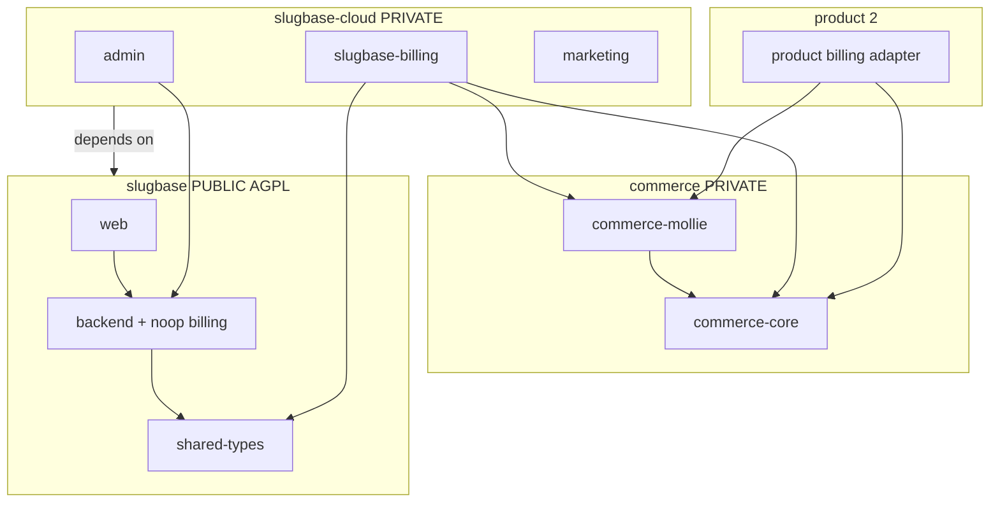

# SlugBase Open-Core Refactor Plan

**Status:** Orchestrator-ready (plan-file mode)  
**Last updated:** 2026-07-20 (Part II + §19–§20 orchestrator runbook)  
**Repos:** `mdg-labs/slugbase` (public) · `mdg-labs/slugbase-cloud` (private) · `mdg-labs/commerce` (private)

**Supersedes:** transitional monorepo `cloud/` layout; Stripe → Mollie work in `packages/backend/` (paused — port from `stash@{0}` into `commerce` + `slugbase-cloud`).

**Audience:** Strategy (Part I) + autonomous agent playbook (Part II). Agents execute Part II tasks in order.

---

## 0. Discussion coverage index

Everything agreed in planning — mapped to plan sections:

| Topic | Decision | Where in plan |
|-------|----------|---------------|
| Real open source CE | AGPL-3.0 replaces ELv2 | §1, Phase 5, TASK-023 |
| Paid Cloud only by MDG Labs | Proprietary `slugbase-cloud` + `commerce`; not in public repo | §1.1, §2, D8 |
| AGPL ≠ blocking free CE hosting | Trademark + proprietary cloud ops | §1.1 |
| Three repos (not monorepo `cloud/`) | `slugbase` · `slugbase-cloud` · `commerce` | §2, D6 |
| Repo already **public** today | Cloud paths still in git history; stop new cloud commits; optional filter-repo | §0.1, TASK-025 |
| Shared billing from **day one** | `commerce` for product 2 + SlugBase | §2.1, D7, TASK-001–004 |
| Mollie migration **paused** | Port from `stash@{0}` only in commerce + slugbase-cloud | §4, §8, TASK-017 |
| No Stripe subscribers | Delete Stripe in CE; greenfield Mollie | §8, TASK-012 |
| Internal invoice ledger (not Mollie Sales Invoices primary) | `commerce-core` owns ledger + PDF | §8 M3, §15.2 |
| Kleinunternehmer §19 UStG now; standard VAT later | `commerce-core` tax module | §2.1, TASK-002 |
| Billing UI in public `web` | `VITE_BILLING_ENABLED` flag | D1, §5.7 |
| npm: `@slugbase` org on npmjs | Public `ui` + `shared-types` | §3.2, TASK-021–022 |
| npm: private on **GitHub Packages** | `@mdg-labs/commerce-*`, `@slugbase/slugbase-billing` | §3.1, §3.3 |
| No npm Pro ($7/mo) yet | Revisit on registry friction | §3.1 |
| Trusted publishing | First **local** publish per package, then OIDC GHA | §3.2 |
| ERP (Lexoffice/sevDesk) | Deferred — CSV export first | Phase 6 |
| **Turnstile removed** | Replace with **Altcha** (self-hosted PoW) behind `CHALLENGE` interface | §0.4, D13, TASK-027 |
| **EU data sovereignty** | Legal drafts + subprocessor tables aligned to actual Cloud stack (no stale US SaaS) | §0.5, D14, TASK-028 |
| Solo-dev order | commerce → slugbase-cloud moves → CE strip → Mollie → legal refresh | §7, §17, §20 |
| **Orchestrator** | Plan-file mode on **this doc** (not roadmap); Lane **S** only; §19–§20 | §19, §20 |
| Workspace `admin` ≠ operator `admin` | `backend/src/admin` stays CE | §5.3, §14.3 |
| Product vocabulary | Personal not Pro; free cap 50; workspace not org | §0.2 |

### 0.1 Public repo reality check

`mdg-labs/slugbase` is **already public**. Until TASK-011 completes, `packages/admin`, `db-admin`, and `marketing` remain visible in history and on the default branch. **Do not add new cloud features there.** After strip, competitors can still read old commits — optional `git filter-repo` (TASK-025) is cosmetic/ hygiene, not a security boundary. The boundary is: **proprietary code lives only in private repos going forward.**

### 0.2 Product vocabulary (agents must not regress)

Per spec §3 / §23.4 — unchanged in CE or cloud:

- Paid tier label: **Personal** (never "Pro")
- Free bookmark cap: **50** (entitlements in CE code; noop bypasses on self-host)
- **Workspace** / **folder** / **pinning** / **slug** / **forwarding** — no org/collection/favorite/redirect vocabulary

### 0.3 Invoicing & tax principles (Mollie scope)

| Principle | Detail |
|-----------|--------|
| Ledger | `commerce-core` `billing_invoices` table — source of truth |
| PDF/email | Generated from ledger; MDG Labs seller block on every invoice |
| Kleinunternehmer | Mandatory §19 UStG wording on invoice; **no VAT charged** now |
| Future VAT | `TaxService` interface extensible; no Mollie Sales Invoices API required for v1 |
| Mollie role | Payments + subscriptions only; webhook → ledger entry + product state sync |

### 0.4 Bot protection — remove Turnstile, use Altcha (decided)

**Remove Cloudflare Turnstile** everywhere (SaaS dependency, privacy, CE/cloud alignment). Keep the existing **`CHALLENGE` interface** (`packages/backend/src/challenge/challenge.interface.ts`) — swap implementation only.

| Option | Verdict |
|--------|---------|
| **Altcha** (recommended) | MIT, proof-of-work, **self-hosted verification** (HMAC secret only — no outbound calls to Cloudflare) |
| mCaptcha | Self-hosted but separate service to operate — heavier for solo dev |
| hCaptcha / reCAPTCHA | SaaS — same class of problem as Turnstile |
| Honeypot + rate limit only | Already have IP rate limit on `POST /contact`; acceptable **CE default** with noop challenge |

**Chosen approach:**

1. **`AltchaChallengeService`** in **cloud-api** when `ALTCHA_HMAC_KEY` is set.
2. **CE backend:** no bot challenge on self-host API (contact module removed); optional noop `ChallengeModule` stub only if registration needs it later.
3. **Marketing contact form** — Altcha widget instead of Turnstile (`packages/marketing` in slugbase-cloud).
4. **Delete** `turnstile-challenge.service.ts`, `TURNSTILE_*` / `PUBLIC_TURNSTILE_*` env vars, Turnstile script loads.
5. **Shared later:** if product 2 needs the same widget, extract `@mdg-labs/challenge-altcha` (new small package — **not** in `commerce`, which is billing-only).

**Layered defense (no extra SaaS):** keep existing `IpThrottlerGuard` on contact + registration; optional honeypot field in marketing form (Fast-Follow).

### 0.5 EU data sovereignty — legal & subprocessor alignment (decided)

SlugBase Cloud is operated as an **EU-sovereign stack**: self-hosted or EU-based processors wherever SlugBase controls the integration. Legal copy must match **production reality**, not legacy Fly/Neon/Cloudflare/Stripe/Postmark/Sentry-SaaS drafts.

**Operator baseline (2026-07 — no repo change required for infra):**

| Function | Production choice | Subprocessor row? |
|----------|-------------------|-------------------|
| App + DB hosting | Coolify on MDG Labs EU infrastructure | No — operator-controlled |
| Payments | Mollie (NL) | Yes — Mollie B.V. |
| Bot protection | Altcha OSS, local HMAC verify (TASK-027) | No — no third-party captcha SaaS |
| Analytics | Umami self-hosted | No |
| Error reporting | Sentry **self-hosted** | No |
| Transactional email | **Lettermint** via SMTP (`SMTP_*`) | Yes — if Lettermint relays mail (EU entity; confirm DPA) |
| AI suggestions | EU provider planned (e.g. Infomaniak Euphoria); OpenAI until switch | Yes — only the **configured** provider when feature enabled |
| OAuth login | Google / GitHub / etc. — **user opt-in** | Yes — per enabled IdP, disclosed as optional third-party auth |

**Remove from published legal (stale today):** Fly.io, Neon, Cloudflare CDN/Turnstile, Stripe, Postmark, Sentry SaaS (EU region), and any “always-on US transfer” language that no longer applies.

**Keep / add:** Mollie billing sections (AGB §6), Lettermint (or generic “transactional email provider via SMTP” until counsel names Lettermint), optional OAuth IdP table, self-hosted infrastructure narrative (Umami, Sentry, Coolify), Altcha (no subprocessor — describe as on-server PoW), EU AI provider when shipped.

**Deliverables (TASK-028):**

1. `docs/internal/eu-data-sovereignty-assessment.md` in **slugbase-cloud** — operator source-of-truth for counsel (stack inventory, transfer analysis, what is/is not a subprocessor).
2. Rewrite `docs/internal/legal/drafts/{agb,datenschutz,impressum}.md` (EN + DE) — move entire `legal/` tree with marketing (§14.5).
3. Update marketing legal tests (`load-legal-markdown.spec.ts`, `build-locale.integration.spec.ts`) — assert **new** anchors (e.g. Mollie, Coolify/self-hosted), not Fly.io/Neon/Cloudflare/Stripe.
4. Lawyer review checklist at top of each draft — refresh TIA notes (OAuth + AI only where applicable).

**Timing:** after TASK-017 (Mollie), TASK-027 (Altcha), and TASK-020 (staging smoke confirms stack). May overlap TASK-024; legal content lives in **slugbase-cloud**, not public `slugbase`.

---

## 1. Goals

| Goal | Detail |
|------|--------|
| **Real open source CE** | Public `slugbase` under **AGPL-3.0** (replace ELv2). Self-hosters get full product, **no plan caps** via noop billing. |
| **Proprietary Cloud** | Paid SlugBase Cloud only via **private `slugbase-cloud`** — not in the public repo. |
| **Shared MDG billing** | **`commerce`** repo from day one — invoice/tax/Mollie primitives shared with **product 2** and future MDG Labs SaaS. |
| **Clean CE** | No `isCloud` branches. Cloud extends CE via optional NestJS modules + private npm packages. |
| **Mollie (greenfield)** | No Stripe subscribers. Complete migration in `commerce` + `slugbase-cloud` only. |

### 1.1 License boundaries

| Repo | Visibility | License | Who may use |
|------|------------|---------|-------------|
| `slugbase` | Public | AGPL-3.0 | Anyone (fork + source obligations) |
| `slugbase-cloud` | Private | MDG Labs proprietary | Operator only |
| `commerce` | Private | MDG Labs proprietary | MDG Labs products (npm registry ACL) |

**AGPL does not block** someone hosting a free CE fork with source. Protection for paid Cloud = **proprietary repos** + **trademark** (“SlugBase Cloud”), not license text on CE alone.

---

## 2. Three-repository architecture (decided)

```
┌─────────────────────────────────────────────────────────────────────────┐
│  mdg-labs/commerce (PRIVATE)                                            │
│  Shared billing — all MDG Labs SaaS products                            │
│  @mdg-labs/commerce-core · @mdg-labs/commerce-mollie                   │
└───────────────────────────────┬─────────────────────────────────────────┘
                                │ GitHub Packages (private)
              ┌─────────────────┴─────────────────┐
              ▼                                   ▼
┌─────────────────────────────┐     ┌─────────────────────────────────────┐
│  mdg-labs/slugbase-cloud    │     │  product-2 (your other repo)      │
│  (PRIVATE)                  │     │  depends on @mdg-labs/commerce-*  │
│  SlugBase-specific cloud    │     └─────────────────────────────────────┘
│  admin · marketing · deploy │
│  @slugbase/slugbase-billing │
└──────────────┬──────────────┘
               │ depends on @slugbase/* (semver)
               ▼
┌─────────────────────────────┐
│  mdg-labs/slugbase (PUBLIC) │
│  AGPL CE                    │
│  backend · web · ui · types   │
└─────────────────────────────┘
```

### 2.1 `commerce` (private) — shared billing

```
commerce/
├── LICENSE                         # MDG Labs proprietary
├── package.json                    # pnpm workspace root
├── pnpm-workspace.yaml
├── turbo.json
└── packages/
    ├── commerce-core/              # @mdg-labs/commerce-core
    │   ├── seller/                 # BILLING_SELLER_* profile
    │   ├── tax/                    # Kleinunternehmer §19; VAT hooks later
    │   ├── invoice/                # ledger, numbering, PDF, email
    │   └── webhook/                # idempotency ledger (generic)
    └── commerce-mollie/            # @mdg-labs/commerce-mollie
        ├── client/                 # Mollie client factory
        ├── checkout/               # first payment + subscription primitives
        └── webhooks/               # verify + normalize payment events
```

**Owns:** anything identical on an MDG Labs invoice or Mollie webhook regardless of product.

**Does not own:** plan catalogs, entitlements, seat rules, workspace schema, product UI.

### 2.2 `slugbase-cloud` (private) — SlugBase cloud ops

```
slugbase-cloud/
├── LICENSE                         # MDG Labs proprietary
├── package.json
├── packages/
│   ├── slugbase-billing/           # @slugbase/slugbase-billing
│   │   ├── mollie-billing.service  # implements BillingService (from shared-types)
│   │   ├── plan-config             # BILLING_PLAN_* amounts
│   │   └── nestjs module           # CloudBillingModule
│   ├── admin/                      # operator console (from slugbase/packages/admin)
│   ├── db-admin/                   # operator read DB (from slugbase/packages/db-admin)
│   └── marketing/                # slugbase.app site (from slugbase/packages/marketing)
├── infra/
│   ├── docker/                     # cloud image overlays / compose profiles
│   └── coolify/                    # deploy notes / webhook config
├── e2e/                            # cloud-only Playwright specs (from slugbase/e2e)
└── .github/workflows/
    ├── deploy.yml
    └── build-and-push-cloud-image.yml
```

**Depends on:** `@mdg-labs/commerce-core`, `@mdg-labs/commerce-mollie`, `@slugbase/backend`, `@slugbase/shared-types` (pinned semver from public releases or `workspace:` link in dev).

### 2.3 `slugbase` (public) — AGPL CE

```
slugbase/
├── LICENSE                         # AGPL-3.0 (replace ELv2)
├── packages/
│   ├── backend/                    # core API + noop billing only
│   ├── web/                        # billing UI behind VITE_BILLING_ENABLED=false
│   ├── ui/
│   ├── shared-types/               # BillingService contract (interface only)
│   └── email-templates/
├── e2e/                            # CE Playwright project only
└── .github/workflows/
    └── build-and-push-ce-image.yml
```

**Remove from public repo (after migration):** `packages/admin`, `packages/db-admin`, `packages/marketing`, cloud deploy workflows, Stripe/Mollie implementation, cloud e2e specs.

---

## 3. Dependency & publish model

### 3.1 Registry strategy (decided)

| Scope | Registry | Visibility | Rationale |
|-------|----------|------------|-----------|
| `@slugbase/*` (CE libs) | **[npmjs.com](https://www.npmjs.com)** — `@slugbase` org | Public | Real open-source consumption; matches `@mdg-labs/blog` publish-first pattern |
| `@mdg-labs/commerce-*` | **GitHub Packages** | Private | Included in GitHub subscription; tiny tarballs; GHA `GITHUB_TOKEN` publish/install |
| `@slugbase/slugbase-billing` | **GitHub Packages** | Private | SlugBase-cloud only; never on public npm |

**Do not pay npm Pro ($7/mo) yet** — private packages stay on GitHub Packages until non-GitHub CI or registry friction forces a move. Revisit if Coolify server-side `pnpm install` of private pkgs becomes painful.

| Package | Published to | Consumers |
|---------|--------------|-----------|
| `@slugbase/shared-types`, `@slugbase/ui` | npmjs (`@slugbase` org) | CE community, slugbase-cloud |
| `@slugbase/backend`, `@slugbase/web` | Docker GHCR (CE images) | Self-hosters |
| `@mdg-labs/commerce-core`, `@mdg-labs/commerce-mollie` | GitHub Packages (private) | slugbase-cloud, product 2 |
| `@slugbase/slugbase-billing` | GitHub Packages (private) | slugbase-cloud deploy only |

### 3.2 npmjs — `@slugbase` org & trusted publishing

The **`@slugbase` npm organization** is created. Public CE packages publish under that scope.

**npm Trusted Publishing (OIDC) requires the package to already exist** — the Trusted Publisher settings page only appears after at least one version is on the registry. First publish per package must use a conventional method (local CLI or one-time granular access token); subsequent publishes use GitHub Actions OIDC (no long-lived `NPM_TOKEN`).

**Bootstrap sequence (once per new public package):**

1. Ensure `package.json` has `"name": "@slugbase/<pkg>"`, `"publishConfig": { "access": "public" }`, and correct `repository` URL.
2. **First publish** (local, from package directory):
   ```bash
   npm login   # or NPM_TOKEN with publish rights to @slugbase
   pnpm build  # if needed
   npm publish --access public
   ```
3. On [npmjs.com](https://www.npmjs.com) → package → **Settings → Trusted Publisher** → GitHub Actions:
   - Owner: `mdg-labs`
   - Repository: `slugbase` (or the publishing repo)
   - Workflow filename: e.g. `publish-npm.yml`
   - Environment: `npm` (optional but recommended; case-sensitive)
4. Add GHA workflow with `permissions: id-token: write` — no `NODE_AUTH_TOKEN` secret after setup:
   ```yaml
   permissions:
     contents: read
     id-token: write
   environment: npm
   steps:
     - uses: actions/setup-node@v4
       with:
         node-version: "22"
         registry-url: https://registry.npmjs.org
     - run: pnpm publish --access public
   ```
5. Revoke or narrow the one-time granular token used for step 2 if applicable.

**Initial targets:** `@slugbase/shared-types`, `@slugbase/ui` (when extracted for external CE consumers). `email-templates` can stay internal until needed.

### 3.3 GitHub Packages — private packages only

**Do not** set `@slugbase:registry=https://npm.pkg.github.com` globally — that breaks public npm packages.

Per-package `publishConfig` for private packages:

```json
{
  "name": "@slugbase/slugbase-billing",
  "publishConfig": {
    "registry": "https://npm.pkg.github.com"
  }
}
```

```json
{
  "name": "@mdg-labs/commerce-core",
  "publishConfig": {
    "registry": "https://npm.pkg.github.com"
  }
}
```

**Consumer `.npmrc`** (slugbase-cloud CI + local dev):

```ini
@mdg-labs:registry=https://npm.pkg.github.com
//npm.pkg.github.com/:_authToken=${GITHUB_TOKEN}
```

Public CE packages (`@slugbase/ui`, `@slugbase/shared-types`) use **default** `registry.npmjs.org` with:

```json
"publishConfig": {
  "access": "public",
  "registry": "https://registry.npmjs.org"
}
```

Private `@slugbase/slugbase-billing` resolves via **package-level** `publishConfig.registry` when installing from slugbase-cloud — no scope-wide override needed if using full package name in deps.

### 3.4 Local dev (solo, three repos in one workspace)

```bash
# Option A — pnpm overrides in slugbase-cloud/package.json (dev only)
"pnpm": {
  "overrides": {
    "@mdg-labs/commerce-core": "link:../commerce/packages/commerce-core",
    "@mdg-labs/commerce-mollie": "link:../commerce/packages/commerce-mollie"
  }
}

# Option B — file: in package.json (never commit to main — dev.local only)
```

**Rule:** never commit `file:../` to `commerce` or `slugbase-cloud` main — use GitHub Packages for CI/deploy (same pattern as `@mdg-labs/blog` publish-first).

### NestJS wiring (cloud API image)

```typescript
// slugbase-cloud/packages/slugbase-billing/src/slugbase-billing.module.ts
@Module({
  imports: [CommerceMollieModule, CommerceCoreModule],
  providers: [
    SlugbaseMollieBillingService,
    { provide: BILLING, useClass: SlugbaseMollieBillingService },
  ],
  exports: [BILLING],
})
export class SlugbaseBillingModule {}

// Cloud API bootstrap (slugbase-cloud) replaces CE BillingModule import
```

CE Docker image **never** installs `@mdg-labs/*` or `@slugbase/slugbase-billing`.

---

## 4. Stash reference — port map

Mollie WIP is preserved in `slugbase` git stash:

```
stash@{0}: wip/mollie-reference-before-open-core-split
```

| Stashed path (slugbase) | Destination |
|-------------------------|-------------|
| `billing-tax.service.ts` | `commerce/packages/commerce-core/src/tax/` |
| `billing-invoice.*`, `billing-invoice.schema.ts`, `0006_billing_invoices.sql` | `commerce/packages/commerce-core/src/invoice/` |
| `mollie-*.ts`, `mollie-client.factory.ts` | `commerce/packages/commerce-mollie/src/` |
| `billing-redirect.util.ts` | `commerce-mollie` or `slugbase-billing` (if SlugBase-specific URLs) |
| `billing-application.service.ts` (webhook orchestration) | **SPLIT** — generic idempotency → commerce; workspace plan sync → slugbase-billing |
| `billing.controller.ts` (Mollie routes) | `slugbase-billing` (+ thin re-export in cloud API bootstrap) |
| `plan-config.service.ts` (`BILLING_PLAN_*`) | `slugbase-billing` |
| `billing.module.ts` Mollie factory | `slugbase-billing` NestJS module |
| Web billing API changes | **KEEP** in `slugbase/packages/web` (UI behind flag) |
| `billing.contract.ts` API extensions | **KEEP** in `slugbase/packages/shared-types` — add cancel/reactivate/change-plan/payment-method; **remove** `BillingPortal*` types (portal deleted) |
| `billing-api.contract.ts` | **KEEP** — extend routes for M2; remove portal route from OpenAPI |
| `workspace-billing.util.ts` `cancelledWithGraceAccess` | Port to `slugbase-billing` (from stash) |
| `shared-types/src/index.ts` | Remove stale `BillingPortal*` exports after contract change |

```bash
# Inspect stash without applying
git -C ../slugbase stash show -u --name-only stash@{0}

# Extract one file for porting
git -C ../slugbase show stash@{0}^3:packages/backend/src/billing/billing-tax.service.ts
```

---

## 5. Complete logic inventory (three-way)

Legend: **CE** = public `slugbase` · **COM** = `commerce` · **CLD** = `slugbase-cloud`

### 5.1 Billing & payments

| Current path (`slugbase`) | CE | COM | CLD |
|---------------------------|----|----|-----|
| `billing/mollie-*.ts` | — | ✓ | adapter |
| `billing/billing-tax.service.ts` | — | ✓ | — |
| `billing/billing-invoice.*` | — | ✓ | — |
| `billing/stripe-*.ts` | delete | — | — |
| `billing/billing-application.service.ts` | noop paths | webhook idempotency | workspace sync |
| `billing/billing.controller.ts` | pricing + noop | — | Mollie routes |
| `billing/pricing.service.ts` | static catalog | — | config amounts |
| `billing/plans/plan-config.service.ts` | — | — | ✓ |
| `billing/plans/plan-catalog.ts` | ✓ | — | — |
| `billing/plans/entitlement-sets.ts` | ✓ | — | — |
| `billing/noop-billing.service.ts` | ✓ | — | — |
| `billing/billing.module.ts` | noop only | — | imports SlugbaseBillingModule |
| `shared-types/billing.contract.ts` | ✓ | — | — |
| `shared-types/billing-api.contract.ts` | CE subset | — | full cloud API |

### 5.2 Database

| Artifact | CE | COM | CLD |
|----------|----|----|-----|
| `workspaces.billing_*`, `plan_*` | ✓ nullable | — | populated |
| `billing_invoices` | — | schema in commerce-core | migration in cloud deploy |
| `billing_webhook_events` | — | ✓ generic table | — |

### 5.3 Operator & marketing

| Current path | CE | COM | CLD |
|--------------|----|----|-----|
| `packages/admin/**` | — | — | ✓ |
| `packages/db-admin/**` | — | — | ✓ |
| `packages/marketing/**` | — | — | ✓ |
| `backend/src/admin/**` (workspace SMTP/AI) | ✓ | — | — |

### 5.4 Analytics & interfaces

| Path | CE | COM | CLD |
|------|----|----|-----|
| `umami-analytics.service.ts` | — | — | ✓ (or slugbase-cloud infra) |
| `noop-analytics.service.ts` | ✓ | — | — |
| Turnstile / challenge | **REMOVE Turnstile** → **Altcha** when `ALTCHA_HMAC_KEY` set; noop default | — | cloud marketing + contact API |

### 5.5 CI/CD & e2e

| Path | CE | COM | CLD |
|------|----|----|-----|
| `deploy.yml`, `build-and-push-cloud-image.yml` | — | — | ✓ |
| `build-and-push-ce-image.yml` | ✓ | — | — |
| `scripts/ci/cloud-*` | — | — | ✓ |
| `e2e/specs/billing/**` | — | — | ✓ |
| `e2e/specs/settings/entitlement-gates.spec.ts` | — | — | ✓ |
| `e2e/specs/settings/ce-operator-settings.spec.ts` | ✓ | — | — |

### 5.6 Environment variables

| Vars | CE | COM | CLD |
|------|----|----|-----|
| `MOLLIE_*` | — | ✓ | ✓ (deploy) |
| `BILLING_SELLER_*`, `BILLING_VAT_*`, `BILLING_INVOICE_*` | — | ✓ | — |
| `BILLING_PLAN_*` (SlugBase prices) | — | — | ✓ |
| `STRIPE_*` | delete everywhere | — | — |
| `TURNSTILE_*`, `PUBLIC_TURNSTILE_*` | delete everywhere | — | — |
| `ALTCHA_HMAC_KEY` | optional (noop if unset) | — | ✓ cloud contact |
| Core auth/DB secrets | ✓ | — | ✓ (cloud deploy) |

### 5.7 Web (`packages/web`)

| Area | Decision |
|------|----------|
| `routes/settings/billing/**` | **KEEP in CE** — hidden via `VITE_BILLING_ENABLED=false`; cloud build sets `true` |
| Entitlement banners / gates | **KEEP in CE** — inert when noop billing |

### 5.8 Shared types & edition

| Path | Decision |
|------|----------|
| `edition/edition-presets.ts` | **KEEP in CE** — single source of truth for preset defaults |
| `SLUGBASE_EDITION` | CE CI/build: `ce` only. Cloud builds in slugbase-cloud: `cloud` at build time via `cloud-vite-build-args.sh` |
| `billing.contract.ts` | KEEP — cloud implements; remove `BillingPortal*` when porting stash |
| `billing-api.contract.ts` | KEEP — add Mollie era routes; drop portal route |
| `shared-types/src/index.ts` | Sync exports after contract changes (TASK-017) |

---

## 6. Target runtime architecture



---

## 7. Execution phases (solo-dev order)

> **Detailed steps:** Part II §17–§18 (`TASK-000` … `TASK-028`).

Product 2 in parallel → **scaffold `commerce` first**, then split slugbase.

### Phase 0 — Stabilize slugbase ✅
- [x] Mollie WIP stashed (`stash@{0}`)
- [x] `commerce` + `slugbase-cloud` repos created
- [x] This plan committed to `slugbase/docs/internal/`

### Phase 1 — Scaffold `commerce` (week 1) **← start here**
- [ ] pnpm workspace + `turbo.json` + proprietary `LICENSE`
- [ ] `@mdg-labs/commerce-core` — seller config, tax (Kleinunternehmer), invoice types
- [ ] `@mdg-labs/commerce-mollie` — client factory (port from stash)
- [ ] GitHub Packages publish workflow (private; `GITHUB_TOKEN`, no npm token)
- [ ] Unit tests for tax note + invoice numbering
- [ ] **Wire product 2** as first consumer (validates API before SlugBase port)

**npmjs (parallel, when first public package is ready):**
- [ ] First local publish of `@slugbase/shared-types` or `@slugbase/ui` to `@slugbase` org
- [ ] Configure Trusted Publisher on npmjs → GHA workflow `publish-npm.yml`
- [ ] Remove reliance on long-lived `NPM_TOKEN` for routine publishes

### Phase 2 — Scaffold `slugbase-cloud` (week 1–2)
- [ ] pnpm workspace + proprietary `LICENSE`
- [ ] Move `packages/admin` → `slugbase-cloud/packages/admin` (git history optional)
- [ ] Move `packages/db-admin` → `slugbase-cloud/packages/db-admin`
- [ ] Move `packages/marketing` → `slugbase-cloud/packages/marketing`
- [ ] Move cloud GHA workflows + `scripts/ci/cloud-*`
- [ ] Move cloud e2e specs + playwright cloud project
- [ ] Add `@mdg-labs/commerce-*` dependency; CI green on moved packages alone

### Phase 3 — Strip public `slugbase` to CE (week 2)
- [ ] Remove `packages/admin`, `db-admin`, `marketing` from workspace
- [ ] Remove cloud deploy workflows from public repo
- [ ] `billing.module.ts` → **noop only**; delete Stripe implementation
- [ ] CE CI + GHCR build green without cloud packages
- [ ] README: CE self-host vs SlugBase Cloud (commercial) + trademark note

### Phase 4 — `slugbase-billing` + Mollie (week 2–4)
- [ ] Create `slugbase-cloud/packages/slugbase-billing`
- [ ] Port stash → commerce (generic) + slugbase-billing (SlugBase-specific)
- [ ] Cloud API image: swap `BillingModule` for `SlugbaseBillingModule`
- [ ] M1–M5 migration (see §8) scoped to commerce + slugbase-billing
- [ ] Staging deploy: pay yourself once end-to-end
- [ ] TASK-028 — EU sovereignty legal refresh (AGB + Datenschutz + impressum; see §0.5)

### Phase 5 — License & public CE cleanup (week 4–5, can overlap)
- [ ] Replace `LICENSE` ELv2 → **AGPL-3.0** on public `slugbase`
- [ ] Add `TRADEMARK.md`
- [ ] Update `slugbase-mvp-spec.md` §2.2, §11.4, §14, §15
- [ ] Phase secrets: split Development inventories per repo
- [ ] Optional: `git filter-repo` to remove cloud paths from public history (if desired)

### Phase 6 — ERP / accounting (defer)
- [ ] Internal invoice CSV export from `commerce-core`
- [ ] Lexoffice/sevDesk when invoice volume warrants — not blocking launch

---

## 8. Mollie migration checklist (commerce + slugbase-cloud)

Greenfield — no Stripe subscribers. Port from `stash@{0}`.

| Step | Owner repo | Work |
|------|------------|------|
| M1 | `commerce-mollie` + `slugbase-billing` | `@mollie/api-client`, checkout + webhook normalize |
| M2 | `slugbase-billing` + `slugbase/web` | In-app cancel / reactivate / change-plan / payment-method; **remove portal** from web + API |
| M3 | `commerce-core` | Kleinunternehmer §19 note; `billing_invoices` ledger + PDF |
| M4 | `slugbase-billing` | Team seats + plan upgrade/downgrade on Mollie subscriptions |
| M5 | all | Delete Stripe; tests; admin `BillingPage`; Mollie Dashboard webhooks; CSRF exempt `POST /billing/webhooks/mollie` — **legal copy → TASK-028** (not a one-liner in M5) |

**Invoicing:** internal ledger in `commerce-core` is source of truth; Mollie Sales Invoices API optional later.

---

## 9. Resolved decisions

| # | Decision |
|---|----------|
| D1 | Billing UI stays in public `web`, gated by `VITE_BILLING_ENABLED` |
| D2 | `billing_invoices` + `billing_webhook_events` live in **commerce** schema; cloud deploy runs migrations |
| D3 | Entire `marketing` package → **slugbase-cloud** |
| D4 | **Public** `@slugbase/ui` + `shared-types` → **npmjs** (`@slugbase` org, trusted publishing after first local publish). **Private** `@mdg-labs/commerce-*` + `@slugbase/slugbase-billing` → **GitHub Packages** (no npm Pro unless friction) |
| D5 | `TRADEMARK.md` on public slugbase |
| D6 | Repo model: **three repos** (not monorepo `cloud/`) — decided |
| D7 | Shared billing from **day one** because product 2 is in flight |
| D8 | Cloud code **not** in public repo — migrate out, stop adding cloud commits to public `staging` |
| D9 | **Internal invoice ledger** in `commerce-core`; Mollie for payments only |
| D10 | **Coolify + private registry** (`berth.mdg-labs.dev`) stays on slugbase-cloud deploy — CE uses GHCR only |
| D11 | `SLUGBASE_EDITION` — CE CI/build uses `ce` only; cloud web/api builds run from slugbase-cloud with `cloud-vite-build-args.sh` / `SLUGBASE_EDITION=cloud` |
| D12 | `edition-presets.ts` stays in CE `shared-types`; cloud deploy sets env explicitly (no edition branching in app code) |
| D13 | **Remove Turnstile** — replace with **Altcha** (self-hosted PoW) behind existing `CHALLENGE` interface; noop when `ALTCHA_HMAC_KEY` unset |
| D14 | **EU data sovereignty legal refresh** — rewrite hosted legal drafts + subprocessor tables to match Coolify/Mollie/Altcha/Lettermint/self-hosted Sentry+Umami; remove stale US SaaS (Stripe, Turnstile, Postmark, Fly, Neon, Sentry SaaS); OAuth + AI disclosed per §0.5 — TASK-028 |

---

## 10. Success criteria

- [ ] Public `slugbase` builds + tests with **zero** `packages/admin|db-admin|marketing` and **zero** Mollie/Stripe deps
- [ ] `commerce` publishes `@mdg-labs/commerce-core` consumed by **product 2** and **slugbase-cloud**
- [ ] `slugbase-cloud` deploys to staging with Mollie checkout + internal invoice row
- [ ] `rg 'stripe|STRIPE'` → zero across all three repos
- [ ] `rg 'isCloud|SLUGBASE_MODE'` in public `slugbase/packages/` → zero
- [ ] AGPL `LICENSE` on public repo; proprietary `LICENSE` on private repos
- [ ] Hosted legal drafts in **slugbase-cloud** match EU sovereignty baseline (§0.5); no Stripe/Turnstile/Postmark/Fly/Neon in published privacy copy
- [ ] `eu-data-sovereignty-assessment.md` exists in slugbase-cloud for counsel handoff

---

## 11. Immediate next actions

1. **Orchestrator pre-flight** — complete §19.1 checklist (workspace roots, stash, empty-repo bootstrap).
2. **Linear** — create epic **Open-core three-repo split** with leaf issues `TASK-000` … `TASK-028` (§20.1); skip `TASK-010` if product 2 not in scope.
3. **TASK-000** — commit this plan + `REFACTOR-IN-PROGRESS.md` on `slugbase` `staging`.
4. **Orchestrate** — invoke orchestrator skill: *"Execute open-core refactor per `docs/internal/open-core-refactor-plan.md` plan-file mode, Lane S, Linear sync ON."*
5. **Freeze** — no cloud/billing commits on public `slugbase` except CE-strip tasks until TASK-011 completes.

---

## 12. Related docs to update

| Doc | Repo |
|-----|------|
| `open-core-refactor-plan.md` | slugbase (this file) |
| `slugbase-mvp-spec.md` | slugbase |
| `engineering-decisions.md` | slugbase |
| `environment-variables.md` | slugbase (+ copies in cloud/commerce as needed) |
| `commerce/README.md` | commerce (create) |
| `slugbase-cloud/README.md` | slugbase-cloud (create) |
| `eu-data-sovereignty-assessment.md` | slugbase-cloud (TASK-028 — operator + counsel) |
| `docs/internal/legal/drafts/*.md` | slugbase-cloud (hosted AGB/Datenschutz/Impressum — TASK-006 move, TASK-028 rewrite) |
| `.cursor/rules/00-project.mdc` | slugbase |

---

# Part II — Autonomous execution playbook

> **Audience:** Cursor agents / orchestrator. Execute tasks **in order** unless marked parallel. Each task ends with a **Verification** block — do not proceed on failure.

## 13. Agent execution contract

### 13.1 Hard rules

1. **No cloud/billing commits on public `slugbase` `staging`** after TASK-000 except CE-strip tasks (noop billing, deletions).
2. **Never commit `file:../` cross-repo links** — use `pnpm.overrides` in a gitignored `pnpm-workspace.local.yaml` or document multi-checkout paths for CI only.
3. **Never use `isCloud` / `SLUGBASE_MODE` branches** — cloud selects modules at bootstrap, not runtime edition checks in product logic.
4. **Preserve `BillingService` contract** in `@slugbase/shared-types` — cloud implements; CE uses `NoopBillingService`.
5. **Mollie port source:** `git -C slugbase stash show` / `git show stash@{0}^3:…` — do not re-apply full stash to slugbase.
6. **Scoped CI per repo** — see §19.4 and §21; full gate before push per `06-local-ci-before-commit.mdc`.
7. **One task = one commit** per repo; conventional subject; issue keys in body when tracker exists.

### 13.2 Cursor workspace (multi-root)

| Path | Repo | Role |
|------|------|------|
| `/home/mdguggenbichler/projects/slugbase` | `mdg-labs/slugbase` (public) | AGPL CE — **orchestrator primary checkout** |
| `/home/mdguggenbichler/projects/slugbase-cloud` | `mdg-labs/slugbase-cloud` (private) | Cloud ops + billing adapter |
| `/home/mdguggenbichler/projects/commerce` | `mdg-labs/commerce` (private) | Shared MDG billing |
| `/home/mdguggenbichler/projects/slugbase-docs` | docs | Customer docs (update later) |

> **Note:** `.cursor/skills/orchestrator/SKILL.md` still lists `/home/michael/projects/slugbase` — ignore; use paths above (TASK-024 may align skill file).

### 13.3 Cross-repo CI checkout layout

`slugbase-cloud` and `commerce` GHA jobs **check out sibling repos**:

```yaml
# slugbase-cloud/.github/actions/setup-slugbase/action.yml (create)
- uses: actions/checkout@v4
  with:
    path: slugbase-cloud
- uses: actions/checkout@v4
  with:
    repository: mdg-labs/slugbase
    ref: staging          # pin via input in production
    path: slugbase
```

Local dev `slugbase-cloud/pnpm-workspace.yaml`:

```yaml
packages:
  - "packages/*"
  - "../slugbase/packages/shared-types"
  - "../slugbase/packages/ui"
  - "../slugbase/packages/email-templates"
  - "../slugbase/packages/backend"
  - "../slugbase/packages/web"
```

`commerce` stays self-contained (no slugbase checkout).

---

## 14. Current slugbase inventory (baseline 2026-07-20)

### 14.1 Packages (8 → 5 in CE)

| Package | Path | Lines of deps | Destination |
|---------|------|---------------|-------------|
| `@slugbase/backend` | `packages/backend/` | stripe ^18.5.0 | **CE** — strip Stripe |
| `@slugbase/web` | `packages/web/` | ui, RR7 | **CE** |
| `@slugbase/ui` | `packages/ui/` | — | **CE** → publish npm |
| `@slugbase/shared-types` | `packages/shared-types/` | — | **CE** → publish npm |
| `@slugbase/email-templates` | `packages/email-templates/` | — | **CE** |
| `@slugbase/admin` | `packages/admin/` | db-admin | **MOVE → slugbase-cloud** |
| `@slugbase/db-admin` | `packages/db-admin/` | — | **MOVE → slugbase-cloud** |
| `@slugbase/marketing` | `packages/marketing/` | @mdg-labs/blog | **MOVE → slugbase-cloud** |

### 14.2 Backend billing tree (28 files today)

**CE keep (16 files):**

```
packages/backend/src/billing/
  noop-billing.service.ts (+ .spec.ts)
  billing-profile.service.ts
  billing-application.service.ts (+ .spec.ts)  # strip Stripe webhook paths → cloud
  billing.controller.ts (+ strip portal/stripe webhook routes → cloud controller)
  billing.module.ts                          # noop-only factory
  billing.tokens.ts                          # remove STRIPE_* tokens
  pricing.service.ts (+ .spec.ts)              # static catalog only
  pricing.controller.ts
  workspace-billing.util.ts
  billing-webhook-event.repository.ts        # unused in CE or delete if cloud-only
  plans/plan-catalog.ts (+ .spec.ts)
  plans/entitlement-sets.ts
  plans/resolve-plan-entitlements.ts
  plans/plan-config.service.ts (+ .spec.ts)  # remove STRIPE_PRICE_* refs
  plans/plans.module.ts
  downgrade/* (4 files)
```

**DELETE from CE (4 files):**

```
stripe-billing.service.ts
stripe-billing.service.spec.ts
stripe-billing.mapper.ts
stripe-billing.mapper.spec.ts
```

**MOVE logic to commerce + slugbase-cloud (from stash + refactor):**

| Source (stash or current) | Target |
|---------------------------|--------|
| `billing-tax.service.ts` | `commerce/packages/commerce-core/src/tax/` |
| `billing-invoice.service.ts`, `billing-invoice.repository.ts`, `billing-invoice.schema.ts`, `0006_billing_invoices.sql` | `commerce/packages/commerce-core/src/invoice/` |
| `mollie-billing.client.ts`, `mollie-client.factory.ts`, `mollie-billing.mapper.ts` | `commerce/packages/commerce-mollie/src/` |
| `mollie-billing.service.ts` | `slugbase-cloud/packages/slugbase-billing/src/` |
| `billing-redirect.util.ts` | `commerce-mollie` if generic; else `slugbase-billing` |
| Stripe webhook + portal routes | **delete** (Mollie in-app replaces portal) |
| `plan-config.service.ts` Mollie amounts | `slugbase-billing` |

### 14.3 Backend modules — cloud-adjacent (stay in CE unless noted)

| Path | Action |
|------|--------|
| `src/admin/**` | **KEEP** — workspace SMTP/AI (not operator admin) |
| `src/analytics/umami-analytics.service.ts` | **MOVE impl** to `slugbase-cloud/packages/cloud-analytics` OR keep in CE as optional interface (noop default); cloud env selects Umami via config |
| `src/analytics/noop-analytics.service.ts` | KEEP |
| `src/analytics/analytics.module.ts` | KEEP — factory on `UMAMI_*` env (CE unset = noop) |
| `src/challenge/turnstile-challenge.service.ts` | **DELETE** — replace with `altcha-challenge.service.ts` (TASK-027) |
| `src/challenge/challenge.module.ts` | **UPDATE** — factory on `ALTCHA_HMAC_KEY`, not `TURNSTILE_SECRET_KEY` |
| `src/contact/**` | **MOVE** to `slugbase-cloud/packages/cloud-api/src/contact/` — only marketing posts to `POST /contact`; uses `CHALLENGE` (Altcha). Remove `ContactModule` from CE `domain-modules` (TASK-012). |

### 14.4 Operator packages — move verbatim

```bash
# Execute from slugbase repo root (TASK-006) — use git mv to preserve history
git mv packages/admin    ../slugbase-cloud/packages/admin
git mv packages/db-admin ../slugbase-cloud/packages/db-admin
git mv packages/marketing ../slugbase-cloud/packages/marketing
git mv docs/internal/legal ../slugbase-cloud/docs/internal/legal
```

**Admin package contents (88 source files):** `src/server.ts`, `src/routes/*`, `src/auth/*`, `src/jobs/*`, `src/stats/*`, `web/src/**`, `Dockerfile`, `package.json`.

**db-admin (48 files):** `src/schema/*`, `src/public-read/*`, `migrations/`, `drizzle.config.ts`.

**Marketing:** `src/pages/**`, `src/content/blog/**`, `astro.config.mjs`, `wrangler*.jsonc` if present, `src/i18n/locales/{en,de}.json`.

### 14.5 Docker & deploy artifacts

| File | Destination |
|------|-------------|
| `.github/workflows/deploy.yml` | `slugbase-cloud/.github/workflows/deploy.yml` |
| `.github/workflows/deploy-plan.yml` | slugbase-cloud (if cloud-only) |
| `.github/workflows/build-and-push-cloud-image.yml` | slugbase-cloud |
| `.github/workflows/build-and-push-ce-image.yml` | **slugbase** |
| `Dockerfile.marketing` | slugbase-cloud |
| `packages/admin/Dockerfile` | slugbase-cloud (path update) |
| `Dockerfile.api` | **slugbase** (CE) + **slugbase-cloud** copy with `slugbase-billing` dep |
| `Dockerfile.web` | both — CE uses `self-host-vite-build-args.sh`; cloud uses `cloud-vite-build-args.sh` |
| `Dockerfile.legacy` | evaluate delete or CE-only |

**Cloud registry scripts → slugbase-cloud:**

```
scripts/ci/cloud-registry-image.sh
scripts/ci/cloud-registry-image.spec.ts
scripts/ci/run-cloud-migrate.sh
scripts/ci/build-push-registry.sh
scripts/cloud-vite-build-args.sh
scripts/ci/smoke-admin-health.sh
scripts/ci/run-migrate-admin.sh
scripts/validate-deploy-workflow-secrets.ts  # split CE vs cloud policies
```

**Docs → slugbase-cloud (private / operator):**

```
docs/internal/cloud-staging-secrets-inventory.md
docs/internal/eu-data-sovereignty-assessment.md   # create in TASK-028
docs/internal/legal/drafts/                     # entire tree — agb, datenschutz, impressum (TASK-006 git mv)
docs/internal/admin-prd/slugbase-admin-prd.md
```

**Docs stay in slugbase (public CE):**

```
docs/internal/slugbase-mvp-spec.md         # update §2.2 open-core
docs/internal/environment-variables.md     # CE columns; cloud vars → copy in cloud repo
docs/internal/engineering-decisions.md
docs/internal/local-development.md
```

**Phase / secrets (`.phase.json` per repo):**

| Repo | Phase app | Keys |
|------|-----------|------|
| slugbase | `SlugBase` Development | CE: SESSION_SECRET, ENCRYPTION_KEY, DATABASE_URL, auth — **no** MOLLIE/STRIPE |
| slugbase-cloud | New app or same app `/cloud` path | MOLLIE_*, BILLING_PLAN_*, operator admin, UMAMI_*, Coolify webhook |
| commerce | Minimal / none locally | Seller + invoice vars for unit tests only |

**Coolify deploy surfaces (slugbase-cloud only):**

| Surface | Image registry | Notes |
|---------|----------------|-------|
| api | `berth.mdg-labs.dev/slugbase-cloud/api` | `cloud-api` package + `SlugbaseBillingModule` |
| web | private registry | Built from `../slugbase/packages/web` with `cloud-vite-build-args.sh` |
| marketing | private registry | `packages/marketing` in slugbase-cloud |
| admin | private registry | `packages/admin/Dockerfile` |

CE GHCR (`ghcr.io/mdg-labs/slugbase-api`, `slugbase-web`) stays in **slugbase** repo only.

**CE scripts stay in slugbase:**

```
scripts/ci/build-push-ghcr.sh
scripts/self-host-vite-build-args.sh
scripts/ci/run-migrate.sh
scripts/e2e.sh (CE project only after split)
dev.docker-compose.yml
```

### 14.6 GitHub workflows — post-split ownership

| Workflow | slugbase | slugbase-cloud |
|----------|----------|----------------|
| `pr.yml` | ✓ calls CI | ✓ calls cloud CI |
| `staging.yml` | CE CI + CE GHCR only | Cloud deploy pipeline |
| `main.yml` | CE release | Cloud production deploy |
| `ci.yml` | CE packages only | `ci.yml` for admin/marketing/billing |
| `e2e.yml` | CE specs | Cloud specs |
| `release.yml` | CE + npm publish | — |

### 14.7 E2E spec split

**→ slugbase-cloud (`e2e/specs/`):**

```
billing/checkout-redirect.spec.ts
billing/portal-redirect.spec.ts          # DELETE or rewrite → in-app billing (Mollie) in TASK-017
settings/entitlement-gates.spec.ts
entitlements/free-cap.spec.ts
sharing/share-dialog.spec.ts
sharing/scope-filters.spec.ts
sharing/compact-share-modal.spec.ts
sharing/sharing-badge.spec.ts
marketing/** (8 specs)                     # marketing moves with package
```

**→ slugbase CE (`e2e/specs/`):**

```
All other specs (auth, bookmarks, folders, tags, go, command-palette, workspace, smoke)
settings/ce-operator-settings.spec.ts
auth/setup.spec.ts
```

**→ slugbase-cloud (`e2e/specs/`) — also after TASK-006:**

```
legal/legal-links.spec.ts                # legal pages live in marketing (slugbase-cloud)
```

**Playwright config:** copy `e2e/playwright.config.ts` to both repos; cloud keeps `cloud` project; CE keeps `ce` project only. Move `e2e/helpers/`, `e2e/fixtures/`, `e2e/global-setup.ts`, `docker-compose.e2e.yml` — CE gets slim copy; cloud gets full stack including marketing port 4003.

### 14.8 Env vars — `packages/backend/src/config/env.schema.ts`

**Remove from CE schema (TASK-018 / TASK-027):**

```
STRIPE_SECRET_KEY, STRIPE_WEBHOOK_SECRET
STRIPE_PRICE_PERSONAL_MONTHLY, STRIPE_PRICE_PERSONAL_ANNUAL
STRIPE_PRICE_TEAM_MONTHLY, STRIPE_PRICE_TEAM_ANNUAL
STRIPE_PRICE_SUPPORTER
TURNSTILE_SECRET_KEY
PUBLIC_TURNSTILE_SITE_KEY   # marketing build — remove from slugbase-cloud marketing
```

**Remove from CE `.env.example`** (Stripe + Turnstile sections).

**Add (slugbase CE + slugbase-cloud cloud-api):**

```
ALTCHA_HMAC_KEY              # server HMAC secret (Phase Development — generate like SESSION_SECRET)
CHALLENGE_DEV_SKIP           # keep — dev/test bypass
```

**Marketing (slugbase-cloud) build env:**

```
# No PUBLIC_TURNSTILE_SITE_KEY — Altcha widget uses server-issued challenge from API or
# inline HMAC config per Altcha docs (prefer POST /challenge/create endpoint on cloud-api)
```

**Add to commerce `commerce-core` schema:**

```
BILLING_SELLER_*, BILLING_VAT_MODE, BILLING_INVOICE_PREFIX, BILLING_CURRENCY
```

**Add to slugbase-cloud / `slugbase-billing` schema:**

```
MOLLIE_API_KEY, MOLLIE_WEBHOOK_SECRET, MOLLIE_PROFILE_ID
BILLING_PLAN_PERSONAL_MONTHLY_AMOUNT, … (per stash plan-config)
```

**Keep in CE (both editions):** `UMAMI_*` optional — CE noop when unset.

### 14.9 Turbo / version policy edits

**`scripts/lib/package-version-policy.mjs`** — slugbase copy:

```javascript
// REMOVE from SHARED_LIB_CONSUMERS marketing/admin paths
// REMOVE packages/db-admin entry (moves to cloud)
// DEPLOYABLE_DIRS → backend, web only
```

**`scripts/ci/resolve-deploy-plan.mjs`** — split:

- slugbase: `api`, `web` surfaces only
- slugbase-cloud: `marketing`, `admin`, cloud `api`, `web` (private registry)

**`turbo.json` (slugbase)** — remove:

```json
"@slugbase/db-admin#test:integration"
"@slugbase/admin#test:integration"
"@slugbase/admin#build"
```

**`package.json` (slugbase root)** — remove `blog:validate` script or gate behind optional docs.

### 14.10 DB migrations

| Migration | Repo | Notes |
|-----------|------|-------|
| `packages/backend/migrations/0000–0005` | slugbase | CE product schema |
| `packages/backend/migrations/0006_billing_invoices.sql` | commerce → cloud deploy | From stash; not CE |
| `packages/db-admin/migrations/*` | slugbase-cloud | Operator admin schema |
| `billing_webhook_events` table | commerce or cloud migration | Drop from CE if unused after strip |

### 14.11 NestJS cloud bootstrap pattern (required CE refactor)

**Problem:** Cloud API must load `SlugbaseBillingModule` instead of CE `BillingModule` without edition branching.

**Solution (TASK-015):**

1. Add `packages/backend/src/domain-modules.registry.ts`:

```typescript
import { type Type } from "@nestjs/common";
import { BillingModule } from "./billing/billing.module.js";
// …other imports

export const BILLING_MODULE = Symbol("BILLING_MODULE");

export function createDomainModules(billingModule: Type = BillingModule): Type[] {
  return [
    AccountsModule,
  AdminModule, // workspace admin — NOT operator
    // …all modules except BillingModule
    billingModule,
  ];
}

export const defaultDomainModules = createDomainModules();
```

2. Change `domain-modules.ts` to re-export `defaultDomainModules` as `domainModules`.

3. Change `app.module.ts` to import `defaultDomainModules` (unchanged CE behaviour).

4. Create `slugbase-cloud/packages/cloud-api/`:

```typescript
// main.ts — identical bootstrap to backend/main.ts but:
import { createDomainModules } from "@slugbase/backend/domain-modules";
import { SlugbaseBillingModule } from "@slugbase/slugbase-billing";

@Module({
  imports: [
    /* same as AppModule but */ ...createDomainModules(SlugbaseBillingModule),
  ],
})
export class CloudAppModule {}
```

5. Add `package.json` export in `@slugbase/backend`:

```json
"./domain-modules": {
  "types": "./dist/domain-modules.registry.d.ts",
  "default": "./dist/domain-modules.registry.js"
}
```

**Cloud Dockerfile** builds `cloud-api` package, not raw backend `main.ts`.

---

## 15. Commerce repo scaffold (exact files)

### 15.1 Root `commerce/package.json`

```json
{
  "name": "commerce",
  "private": true,
  "packageManager": "pnpm@9.15.4",
  "scripts": {
    "lint": "turbo run lint",
    "typecheck": "turbo run typecheck",
    "test:unit": "turbo run test:unit",
    "build": "turbo run build"
  },
  "devDependencies": {
    "turbo": "^2.5.4",
    "typescript": "^5.8.3",
    "vitest": "^4.1.6"
  }
}
```

### 15.2 `@mdg-labs/commerce-core` public API (initial)

```typescript
// packages/commerce-core/src/index.ts
export { SellerProfile, loadSellerProfile } from "./seller/seller-profile.js";
export { TaxService, TaxMode, kleinunternehmerNote } from "./tax/tax.service.js";
export {
  InvoiceLedger,
  InvoiceRecord,
  InvoiceNumberGenerator,
} from "./invoice/invoice-ledger.js";
export { WebhookIdempotencyStore } from "./webhook/idempotency.js";
```

### 15.3 `@mdg-labs/commerce-mollie` public API (initial)

```typescript
export { createMollieClient, type MollieClient } from "./client/factory.js";
export { verifyMollieWebhook } from "./webhooks/verify.js";
export { normalizePaymentEvent } from "./webhooks/normalize.js";
```

### 15.4 Publish workflow `commerce/.github/workflows/publish-github-packages.yml`

```yaml
on:
  push:
    tags: ["v*"]
permissions:
  contents: read
  packages: write
jobs:
  publish:
    runs-on: ubuntu-latest
    steps:
      - uses: actions/checkout@v4
      - uses: pnpm/action-setup@v4
      - run: pnpm install && pnpm build && pnpm test:unit
      - run: pnpm -r publish --no-git-checks
        env:
          NODE_AUTH_TOKEN: ${{ secrets.GITHUB_TOKEN }}
```

`.npmrc` in commerce:

```
@mdg-labs:registry=https://npm.pkg.github.com
```

---

## 16. Slugbase-cloud repo scaffold

### 16.1 Package dependency graph

```
cloud-api  (@slugbase/cloud-api)
  ├── @slugbase/backend (workspace ../slugbase)
  ├── @slugbase/slugbase-billing
  ├── @mdg-labs/commerce-core (github packages)
  └── @mdg-labs/commerce-mollie

slugbase-billing
  ├── @slugbase/shared-types
  ├── @mdg-labs/commerce-core
  └── @mdg-labs/commerce-mollie

admin
  ├── @slugbase/db-admin
  └── @slugbase/shared-types

marketing
  ├── @slugbase/ui
  └── @slugbase/shared-types

db-admin (unchanged deps)
```

### 16.2 `slugbase-billing` file plan

```
packages/slugbase-billing/
  package.json          # name: @slugbase/slugbase-billing, publishConfig.registry: npm.pkg.github.com
  src/
    index.ts
    slugbase-billing.module.ts
    slugbase-mollie-billing.service.ts   # implements BillingService
    slugbase-billing.controller.ts       # Mollie webhook, cancel, reactivate, change-plan, payment-method
    slugbase-billing-application.service.ts  # workspace plan sync orchestration
    plan-config.service.ts
    workspace-billing.util.ts            # re-export or extend CE util
  vitest.config.ts
```

### 16.3 Rename package scopes (optional TASK-025)

Keep `@slugbase/admin` name in slugbase-cloud for minimal diff, or rename to `@slugbase-cloud/admin` — **recommend keep `@slugbase/admin`** initially to reduce import churn; packages are private on GHCR either way.

---

## 17. Task graph (execute in order)

```
TASK-000  Freeze + plan commit (slugbase)
    │
TASK-001  Scaffold commerce monorepo
    │
TASK-002  Port commerce-core from stash (tax, invoice)
    │
TASK-003  Port commerce-mollie from stash
    │
TASK-004  commerce unit tests + GH Packages publish
    │
    ├──────────────────────────────────┐
    │                                  │
TASK-005  Scaffold slugbase-cloud monorepo
    │                                  │
TASK-006  git mv admin, db-admin, marketing
    │                                  │
TASK-007  Move cloud workflows + scripts + Dockerfiles
    │                                  │
TASK-008  slugbase-cloud CI green (admin, marketing, db-admin)
    │                                  │
TASK-009  Move cloud e2e specs + playwright config
    │
TASK-010  product-2: wire @mdg-labs/commerce-core (parallel with TASK-004+)
    │
TASK-011  CE strip: remove moved packages from slugbase workspace
    │
TASK-012  CE strip: remove Stripe from backend
    │
TASK-013  CE strip: update turbo, version policy, CI (no admin migrate)
    │
TASK-014  CE strip: update Dockerfiles (no marketing package.json COPY)
    │
TASK-015  CE: domain-modules registry refactor
    │
TASK-016  cloud-api package + SlugbaseBillingModule
    │
TASK-017  Port stash → slugbase-billing + wire cloud-api
    │
TASK-018  Env schema split (CE vs cloud vs commerce)
    │
TASK-019  slugbase CE CI + e2e green
    │
TASK-020  slugbase-cloud staging deploy smoke
    │
TASK-021  npm first publish @slugbase/shared-types + @slugbase/ui
    │
TASK-022  npm trusted publishing workflow
    │
TASK-023  AGPL LICENSE + TRADEMARK.md (slugbase)
    │
TASK-024  Docs + .cursor/rules update
    │
TASK-025  Optional history hygiene (operator)
    │
TASK-026  slugbase-cloud version bump policy
    │
TASK-027  Replace Turnstile with Altcha
    │
TASK-028  EU sovereignty legal refresh (AGB + Datenschutz + impressum)
```

---

## 18. Task definitions (verification included)

### TASK-000 — Freeze public slugbase
- [ ] Commit `docs/internal/open-core-refactor-plan.md` to `staging`
- [ ] Add `docs/internal/REFACTOR-IN-PROGRESS.md`:

```markdown
# Open-core refactor in progress

**Plan:** [open-core-refactor-plan.md](./open-core-refactor-plan.md)  
**Mode:** Three repos — `slugbase` (public CE) · `slugbase-cloud` (private) · `commerce` (private)  
**Rule:** No new cloud/billing features on public `staging` until TASK-011 completes.  
**Mollie reference:** `git stash list` → `wip/mollie-reference-before-open-core-split`  
**Orchestrator:** plan-file mode; tasks `TASK-000` … `TASK-028`.
```

- **Verify:** `git stash list` shows `wip/mollie-reference-before-open-core-split`

### TASK-001 — Scaffold commerce
- [ ] **Bootstrap repo:** `commerce` has remote but **no commits** — create `staging` branch; first commit is this scaffold.
- [ ] Create root `pnpm-workspace.yaml`, `turbo.json`, `tsconfig.base.json`, proprietary `LICENSE`, `README.md`
- [ ] Create empty packages with `package.json`, `tsconfig.json`, `src/index.ts`
- **Verify:** `cd commerce && pnpm install && pnpm build` (empty exports OK)

### TASK-002 — commerce-core from stash
- [x] `git show stash@{0}^3:packages/backend/src/billing/billing-tax.service.ts` → port + adapt
- [x] Invoice ledger + drizzle schema (generic — no `workspace_id` coupling in core; adapter in slugbase-billing)
- [x] Vitest: Kleinunternehmer note string
- **Verify:** `pnpm --filter @mdg-labs/commerce-core test:unit`

### TASK-003 — commerce-mollie from stash
- [x] Port client factory + mapper from stash
- [x] No SlugBase plan types in this package
- **Verify:** `pnpm --filter @mdg-labs/commerce-mollie test:unit`

### TASK-004 — Publish commerce to GitHub Packages
- [x] Add `.npmrc`, publish workflow (`60cc3c7`)
- [x] Tag `commerce-v0.1.0` push — **operator follow-up:** push `60cc3c7` to `origin`, then `git tag commerce-v0.1.0 && git push origin commerce-v0.1.0` (or `workflow_dispatch`)
- **Verify:** Package visible at `https://github.com/mdg-labs/commerce/packages` — operator follow-up after tag push

### TASK-005 — Scaffold slugbase-cloud
- [x] **Bootstrap repo:** `slugbase-cloud` has remote but **no commits** — create `staging` branch; first commit is this scaffold.
- [x] Root workspace files (mirror commerce structure)
- [x] `.github/actions/setup-slugbase/action.yml` dual checkout
- [x] `pnpm-workspace.yaml` with `../slugbase/packages/*` paths
- **Verify:** `pnpm install` from slugbase-cloud with slugbase sibling present

### TASK-006 — Move operator packages
- [x] `git mv` admin, db-admin, marketing per §14.4
- [x] `git mv docs/internal/legal` → `slugbase-cloud/docs/internal/legal` (marketing `load-legal-markdown.ts` walks up to `docs/internal/legal/drafts`)
- [x] Fix internal imports (paths unchanged inside packages)
- [x] **Two commits (same task):** (1) `slugbase-cloud` — add moved packages + legal tree; (2) `slugbase` — deletions + any path fixes. Same conventional subject scope per repo; body links same Linear leaf.
- **Verify:** `test ! -d slugbase/packages/admin && test -d slugbase-cloud/packages/admin`

### TASK-007 — Move cloud infra
- [x] Move workflows + scripts per §14.5 (`deploy.yml`, `build-and-push-cloud-image.yml`, etc.) — `slugbase-cloud` `49db0a6`, `slugbase` `33861c9`
- [x] **Delete** moved cloud workflows from `slugbase/.github/workflows/` (CE keeps `build-and-push-ce-image.yml`, `pr.yml`, `ci.yml`, `staging.yml` trimmed)
- [x] Update all `packages/admin` → relative paths in Dockerfiles/workflows
- [x] `resolve-deploy-plan.mjs` copy → slugbase-cloud, trim CE surfaces from slugbase copy
- **Verify:** [x] `pnpm exec vitest run scripts/ci/resolve-deploy-plan.spec.ts` in each repo (34 + 7 tests)

### TASK-008 — slugbase-cloud CI
- [x] `ci.yml` runs lint/typecheck/test/build for admin, marketing, db-admin (`14ea894`)
- [x] Integration: `run-migrate-admin.sh` + admin integration tests
- **Verify:** [x] `pnpm` filters via `scripts/run-cloud-packages.sh` (turbo cross-repo symlink workaround; see TASK-008 notes in session)

### TASK-009 — Cloud e2e
- [x] Move specs per §14.7 (including `legal/legal-links.spec.ts`) — `slugbase-cloud` `d6882de`, `slugbase` `df437f6`
- [x] `e2e.sh` cloud half → slugbase-cloud; CE half stays in slugbase
- **Verify (partial):** [x] Playwright `--list` — cloud 51 tests / CE 38 tests. **Full green** deferred until TASK-017 + TASK-027 (billing + Altcha).

### TASK-010 — Product 2 commerce consumer (OPTIONAL parallel track)

**Status:** `[cancelled]` — no `product-2` repo in operator workspace (2026-07-20). TASK-017 uses commerce unit tests only.

**Skip when:** product 2 repo not in operator workspace — orchestrator marks `cancelled`; TASK-017 proceeds using commerce unit tests only.

- [~] Add `@mdg-labs/commerce-core` dep from GitHub Packages in product 2 repo — **skipped**
- [~] Implement thinnest path: seller profile + tax note OR invoice number generation (no SlugBase types) — **skipped**
- [~] Validates commerce API before SlugBase billing port (TASK-017) — **skipped** (commerce on GH Packages + unit tests sufficient)
- **Verify:** n/a (cancelled)

### TASK-011 — CE workspace strip (post-move cleanup)

**Depends on:** TASK-006 (packages already `git mv`'d out). This task cleans workspace manifests — not a second deletion pass.

- [x] Remove stale `packages/admin`, `db-admin`, `marketing` entries from `pnpm-workspace.yaml` / `turbo.json` if any remain
- [x] Update `pnpm-workspace.yaml` (still `packages/*`)
- [x] `pnpm install` refresh lockfile
- **Verify:** [x] `! test -d packages/admin`

### TASK-012 — Remove Stripe from CE backend
- [x] Delete `stripe-billing.*` files
- [x] `billing.module.ts` — only `NoopBillingService`, no Stripe factory
- [x] `billing-application.service.ts` — remove `processWebhookEvent`, `openPortal`, Stripe imports
- [x] `billing.controller.ts` — remove portal + stripe webhook routes
- [x] Remove `ContactModule` from `domain-modules.ts` (moves to cloud-api)
- [x] `pnpm remove stripe` in backend
- [x] Update/delete affected tests (`billing.e2e-spec.ts`, `pricing.e2e-spec.ts`, etc.)
- **Verify:** [x] CE backend functional Stripe removed (`1ff8cc6`); remaining `stripe` strings deferred TASK-017/018

### TASK-013 — CE CI/turbo/policy
- [x] Edits per §14.9 (most in prior strip commits; `3c5346c` finishes ci.yml)
- [x] `ci.yml` integration: remove `run-migrate-admin.sh`
- [x] `ci.yml` build: `SLUGBASE_EDITION=ce` (not cloud)
- [x] Remove `blog:validate` step
- **Verify:** [x] `bash scripts/with-ci-env.sh pnpm lint && pnpm typecheck && pnpm test:unit && pnpm build`

### TASK-014 — CE Dockerfiles
- [x] `Dockerfile.api` — remove `packages/marketing/package.json` COPY line
- [x] `Dockerfile.web` — same
- [x] `scripts/ci/dockerfile-excludes-admin.spec.ts` — still passes
- **Verify:** [x] `pnpm exec vitest run scripts/ci/dockerfile-excludes-admin.spec.ts`

### TASK-015 — domain-modules registry
- [x] Implement §14.11
- [x] Export path from `@slugbase/backend`
- **Verify:** CE `pnpm --filter @slugbase/backend test:unit` green

### TASK-016 — cloud-api package
- [x] Create `slugbase-cloud/packages/cloud-api` (`@slugbase/cloud-api`) with `CloudAppModule`
- [x] Move `contact/**` from CE backend into `cloud-api/src/contact/` (if not already removed in TASK-012)
- [x] Dockerfile.api in slugbase-cloud builds cloud-api
- **Verify:** `pnpm --filter @slugbase/cloud-api build` (from slugbase-cloud with sibling slugbase)

### TASK-017 — slugbase-billing + Mollie port

**Status:** `[x]` verified 2026-07-20 (retry `3aee53d`)

**Depends on:** TASK-004 (commerce on GH Packages), TASK-015, TASK-016.
- [x] Implement `SlugbaseMollieBillingService` using commerce packages — `436858b` (slugbase-cloud)
- [x] Port stash controller routes (cancel, reactivate, change-plan, payment-method, mollie webhook) — `slugbase-billing.controller.ts`
- [x] Delete portal flow; update web `billing-api.ts` if needed — `bcf1c2b` (slugbase); **remaining:** `e2e/specs/billing/portal-redirect.spec.ts` still Stripe portal (e2e green deferred TASK-019)
- **Verify:** [x] slugbase-cloud `pnpm install` OK; `@slugbase/slugbase-billing` lint/typecheck/test:unit/build PASS (3/3); `@slugbase/cloud-api` build PASS; slugbase `@slugbase/shared-types...` test:unit PASS (20/20); backend + web billing tests PASS

### TASK-018 — Env split
- [x] CE `env.schema.ts` — no STRIPE/MOLLIE
- [x] commerce + slugbase-cloud schemas per §14.8
- [x] Update `docs/internal/environment-variables.md` with repo columns
- **Verify:** [x] `@slugbase/backend` test:unit 535/535; `@slugbase/slugbase-billing` 6/6; `@slugbase/cloud-api` 13/13; `@mdg-labs/commerce-core` 7/7

### TASK-019 — CE e2e
- [ ] `e2e/playwright.config.ts` — remove `cloud` project
- [ ] `scripts/e2e.sh` — CE only
- **Verify:** `pnpm test:e2e --project=ce`

### TASK-020 — Cloud staging deploy

**Operator gate** — execution agent prepares runbook + env checklist; **manual** pay-yourself checkout required for PASS.

- [ ] Phase secrets in slugbase-cloud inventory
- [ ] Mollie Dashboard webhook URL → cloud API
- [ ] Manual: checkout → pay → workspace plan active → invoice row
- **Verify:** operator checklist in deploy runbook

### TASK-021 — npm first publish

**Operator gate** — requires local `npm login` or one-time `NPM_TOKEN` with publish rights to `@slugbase` org.

- [ ] Set `"private": false`, `"publishConfig": { "access": "public", "registry": "https://registry.npmjs.org" }` on ui + shared-types
- [ ] Local `npm publish --access public` for each
- **Verify:** `npm view @slugbase/shared-types version`

### TASK-022 — npm trusted publishing
- [ ] Configure Trusted Publisher on npmjs for each package
- [ ] Add `slugbase/.github/workflows/publish-npm.yml` with `id-token: write`
- **Verify:** dry-run workflow on tag

### TASK-023 — AGPL
- [ ] Replace `LICENSE`, root `package.json` license field, `README.md` badge
- [ ] Add `TRADEMARK.md`
- **Verify:** `rg 'Elastic' LICENSE README.md` → no matches

### TASK-024 — Docs & Cursor rules
- [ ] Update spec §2.2, engineering-decisions, `environment-variables.md`
- [ ] `commerce/README.md`, `slugbase-cloud/README.md`
- [ ] `.cursor/rules/00-project.mdc` — three-repo open-core model
- [ ] `.cursor/rules/02-orchestrator.mdc` — package filter map includes commerce + slugbase-cloud paths
- [ ] `.cursor/skills/orchestrator/prompt-templates.md` — add §19.4 multi-repo CI filter table; fix workspace path in `SKILL.md`
- [ ] `slugbase-docs` — split CE self-host vs Cloud operator docs (separate PR)
- [ ] Cross-link `eu-data-sovereignty-assessment.md` from slugbase-cloud README (content in TASK-028)
- **Verify:** links resolve; orchestrator filter table lists `@mdg-labs/commerce-core`

### TASK-027 — Replace Turnstile with Altcha
- [ ] **Primary:** implement Altcha in `slugbase-cloud/packages/cloud-api` (contact is the only `CHALLENGE` consumer today)
- [ ] Add `altcha` / `altcha-lib` npm dep to cloud-api (+ marketing widget in slugbase-cloud)
- [ ] Create `cloud-api/src/challenge/altcha-challenge.service.ts` (+ spec); wire `ChallengeModule` in cloud-api only
- [ ] **CE slugbase:** delete `turnstile-challenge.service.ts` + spec; remove `TURNSTILE_HTTP` token; either remove `ChallengeModule` from CE `domain-modules` entirely **or** keep noop-only stub for future registration challenge (no Turnstile factory)
- [ ] Register `ALTCHA_HMAC_KEY` in Phase (cloud), `.env.example`, env schema in **cloud-api**, `environment-variables.md`
- [ ] Cloud-api: `POST /challenge/altcha` or use Altcha self-hosted challenge generation per library docs
- [ ] Marketing: replace Turnstile mount in `contact/_ContactPage.astro` + `contact-form.client.ts` with Altcha widget
- [ ] Update `contact-config.ts` — remove `turnstileSiteKey`
- [ ] Remove `PUBLIC_TURNSTILE_SITE_KEY` / `TURNSTILE_SECRET_KEY` from Phase staging inventory
- [ ] Move/update `contact.e2e-spec.ts` to slugbase-cloud; marketing contact tests
- **Verify:** `rg -i 'turnstile|TURNSTILE' packages/` → 0 across slugbase + slugbase-cloud; cloud-api unit tests green

**Altcha implementation notes:**
- Server: verify PoW locally with HMAC secret — **no outbound HTTP** to Cloudflare or third parties
- Client: Altcha web component (bundle in marketing — no external CDN required)
- CE self-host: no contact endpoint, no Altcha needed on CE API image
- **Later:** if `PUBLIC_REGISTRATION` needs bot protection, reuse same Altcha module in CE backend

### TASK-028 — EU sovereignty legal refresh

**Depends on:** TASK-006 (marketing + `docs/internal/legal/` in slugbase-cloud), TASK-017 (Mollie), TASK-027 (Altcha). Run after TASK-020 staging smoke when possible.

- [ ] Create `slugbase-cloud/docs/internal/eu-data-sovereignty-assessment.md` — stack inventory per §0.5 (self-hosted vs EU subprocessor vs optional OAuth/AI transfers); counsel handoff notes
- [ ] **`agb.md` (EN + DE):** replace Stripe billing copy with Mollie; payment data handled by Mollie B.V.; internal invoice ledger wording; remove Stripe authorisation language
- [ ] **`datenschutz.md` (EN + DE):**
  - §3 / processing activities: Mollie payments, Lettermint/SMTP email, optional OAuth IdPs, AI (EU provider when live — until then disclose configured provider or “disabled on Cloud”)
  - §4 cookies: remove Turnstile / Cloudflare bot-widget cookies; remove Sentry SaaS consent copy if browser SDK points at **self-hosted** Sentry (or keep consent only if client SDK still used)
  - §5 retention: align with commerce invoice ledger + Mollie webhook idempotency tables
  - §6 infrastructure table: Coolify EU hosting, operator Postgres — **not** Fly.io / Neon
  - §7 subprocessor table: **Mollie**, **Lettermint** (if applicable), optional **OAuth providers**, **EU AI provider** when enabled — **remove** Stripe, Postmark, Fly.io, Neon, Cloudflare (Turnstile/CDN), Sentry SaaS
  - §3.3 AI: template for EU provider; remove OpenAI-USA default when EU backend ships (or dual-provider disclosure if both configurable)
  - Top-of-file lawyer checklist: refresh TIA list (OAuth + AI only); drop Postmark/OpenAI-USA unless still true
- [ ] **`impressum.md`:** verify controller block unchanged; link targets still valid after marketing move
- [ ] Update `packages/marketing/src/legal/load-legal-markdown.spec.ts` — fixtures/assertions for new section markers and Mollie/self-hosted anchors
- [ ] Update `packages/marketing/src/build-locale.integration.spec.ts` — replace `Fly.io` / `Neon` / `Cloudflare` privacy assertions with sovereignty-aligned strings (e.g. `Mollie`, `Coolify`, self-hosted Umami/Sentry)
- [ ] `e2e/specs/legal/legal-links.spec.ts` — still passes from slugbase-cloud e2e project
- [ ] Remove any `docs/internal/legal/` copies left in public **slugbase** after TASK-006 (CE repo should not ship hosted ToS drafts)
- **Verify:**
  ```bash
  rg -i 'stripe|turnstile|postmark|fly\.io|neon' slugbase-cloud/docs/internal/legal/ → 0
  rg -i 'cloudflare' slugbase-cloud/docs/internal/legal/ → 0  # unless CDN reintroduced — then EU DPA row only
  pnpm --filter @slugbase/marketing test:unit   # from slugbase-cloud workspace
  test -f slugbase-cloud/docs/internal/eu-data-sovereignty-assessment.md
  ```

**Publication gate:** drafts remain `> Zur anwaltlichen Freigabe` until operator sign-off — TASK-028 is **content alignment**, not lawyer substitution.

### TASK-025 — Optional history hygiene (operator)
- [ ] `git filter-repo` to remove `packages/admin|db-admin|marketing` from public slugbase history
- [ ] Force-push only with explicit operator approval
- **Verify:** GitHub default branch tree matches CE layout

### TASK-026 — slugbase-cloud version bump policy
- [ ] Copy/adapt `scripts/lib/package-version-policy.mjs` for cloud deployables (admin, marketing, cloud-api)
- [ ] `.githooks/pre-push` or equivalent in slugbase-cloud
- **Verify:** version bump required when admin/marketing source changes

TASK-027  Replace Turnstile with Altcha  (deps: TASK-016)
    │
TASK-028  EU sovereignty legal refresh (deps: TASK-017, TASK-027, TASK-020)
```

---

## 19. Orchestrator execution runbook

> **Use this section when invoking** `.cursor/skills/orchestrator/SKILL.md` **for the open-core split.** This plan **replaces** `slugbase-development-roadmap.md` for this initiative.

### 19.1 Pre-flight checklist (operator — before TASK-000)

| Check | Command / expectation |
|-------|----------------------|
| Cursor workspace roots | `slugbase`, `slugbase-cloud`, `commerce` siblings under `/home/mdguggenbichler/projects/` (§13.2) |
| `slugbase` on `staging` | `git -C slugbase branch --show-current` → `staging` |
| Mollie stash present | `git -C slugbase stash list` contains `wip/mollie-reference-before-open-core-split` |
| Empty private repos | `commerce` + `slugbase-cloud` have `origin` remotes but **no commits** — TASK-001 / TASK-005 bootstrap `staging` |
| Phase CLI | `phase auth` OK for `SlugBase` Development (rule `09`) |
| Plan committed | TASK-000 done — this file + `REFACTOR-IN-PROGRESS.md` on `slugbase` `staging` |
| Linear epic | Epic **Open-core three-repo split** + leaves `TASK-000`…`TASK-028` (§20.1) — or user says **Linear sync OFF** |
| Product 2 | In workspace? → schedule TASK-010. Else orchestrator **skips** TASK-010 |

### 19.2 Orchestrator mode & lane policy

| Setting | Value |
|---------|-------|
| **Mode** | **Plan-file** — task IDs `TASK-NNN` in **this document** (§18), not `P*-*` roadmap rows |
| **Plan file WRITE** | Orchestrator may set `[~]` / `[x]` / `[!]` on §20.2 status column only |
| **Lane** | **S (serial) only** — multi-repo, shared contracts, DB migrations, dual commits. **No Lane P** unless operator explicitly overrides |
| **Integration branch** | `staging` in **each** repo (`commerce`, `slugbase-cloud`, `slugbase`) |
| **Push** | **Never** unless operator asks; never push `main` |
| **Commits** | One implementation commit **per repo touched** per task (TASK-006 = two commits) |
| **Doc refs for sub-agents** | This plan § sections + `docs/internal/slugbase-mvp-spec.md` §2.2, §11.4, §14, §15, §23.4 — **not** pasted bodies |

**Invocation (copy to orchestrator chat):**

```text
Execute the open-core three-repo refactor in plan-file mode.
Plan: slugbase/docs/internal/open-core-refactor-plan.md (Part II + §19–§20).
Lane: S only. Linear sync: ON. Start at first unchecked TASK in §20.2.
Do not read roadmap P*-* rows for this run.
```

### 19.3 Execution batches (Lane S — recommended order)

| Batch | Tasks | Notes |
|-------|-------|-------|
| **0** | TASK-000 | slugbase only |
| **1** | TASK-001 → TASK-004 | `commerce` repo; publish blocks TASK-017 |
| **2** | TASK-005 → TASK-009 | `slugbase-cloud` + slugbase deletions/moves; parallel with batch 1 after TASK-001 |
| **3** | TASK-011 → TASK-014 | CE strip on slugbase |
| **4** | TASK-015 | domain-modules registry (slugbase) |
| **5** | TASK-016 → TASK-017 | cloud-api + slugbase-billing; needs TASK-004 |
| **6** | TASK-018 | env split (all three repos) |
| **7** | TASK-019 | CE e2e green |
| **8** | TASK-027 | Altcha (cloud-api + marketing) |
| **9** | TASK-020 | **Operator gate** — staging deploy + manual payment |
| **10** | TASK-021 → TASK-024, TASK-026, TASK-028 | license, docs, legal, version policy |
| **opt** | TASK-010 | product 2 — parallel with batch 1 if repo available |
| **opt** | TASK-025 | operator-only history hygiene |

**Batch 1 publish gate (TASK-004):** cleared **2026-07-20** — `@mdg-labs/commerce-core@0.1.0` and `@mdg-labs/commerce-mollie@0.1.0` on GitHub Packages. TASK-017 commerce dependency satisfied; still requires TASK-015 + TASK-016 before batch 5.

### 19.4 Scoped CI — multi-repo filter map

Extend orchestrator `SCOPED CI GATE` block (`.cursor/skills/orchestrator/prompt-templates.md`) for this initiative:

| Path prefix | Repo | `pnpm` filter / command |
|-------------|------|-------------------------|
| `commerce/packages/commerce-core/` | commerce | `pnpm --filter @mdg-labs/commerce-core` (no `with-ci-env` required) |
| `commerce/packages/commerce-mollie/` | commerce | `pnpm --filter @mdg-labs/commerce-mollie` |
| `slugbase-cloud/packages/cloud-api/` | slugbase-cloud | `bash scripts/with-ci-env.sh pnpm --filter @slugbase/cloud-api …` |
| `slugbase-cloud/packages/slugbase-billing/` | slugbase-cloud | `… --filter @slugbase/slugbase-billing` |
| `slugbase-cloud/packages/admin/` | slugbase-cloud | `… --filter @slugbase/admin...` |
| `slugbase-cloud/packages/marketing/` | slugbase-cloud | `… --filter @slugbase/marketing` |
| `slugbase-cloud/packages/db-admin/` | slugbase-cloud | `… --filter @slugbase/db-admin` |
| `slugbase/packages/**` | slugbase | existing `@slugbase/<pkg>` rules |
| `packages/shared-types`, `packages/ui` | slugbase | `--filter @slugbase/<pkg>...` (downstream) |
| `docs/**`, `*.md`, `.cursor/**` | any | CI gate **skipped** — targeted validation only |

**slugbase-cloud jobs** require sibling checkout `../slugbase` on `staging` (§13.3).

### 19.5 Sub-agent prompt extras (beyond §21 template)

Every dispatch **must** include:

```text
PLAN: docs/internal/open-core-refactor-plan.md
TASK: TASK-NNN
LANE: S
REPOS WRITABLE: <absolute paths>
REPOS READ-ONLY: <absolute paths>
WRITE SCOPE: <paths from §20.2>
STAGED CI: <filter from §19.4>
PARALLEL: no
STASH REF: git -C slugbase show stash@{0}^3:<path>  (Mollie ports only — never git stash apply)
CLOSE_PARENTS: none  (unless final task under epic — orchestrator sets)
```

**Also include** PLAN FILE GUARD from `.cursor/skills/orchestrator/prompt-templates.md` in **every verifier** prompt (`AUTHORIZED_TASK_ID: TASK-NNN`). Orchestrator: commit dirty plan reconciliation **before** verifier dispatch, or pass `PLAN_FILE_DIRTY: preserve`.

**FORBIDDEN:** `git stash apply` / `git stash pop` on slugbase; `file:../` in committed package.json; cloud features on public slugbase after TASK-000 except CE-strip tasks.

### 19.6 Verifier notes (multi-repo tasks)

- **PLAN FILE GUARD** — mandatory in every verifier prompt (`.cursor/skills/orchestrator/prompt-templates.md`). Surgical edit: only the leaf task's Status cell. If plan is dirty with other rows' changes → `PLAN_FILE_BLOCKED`; orchestrator commits reconcile first.
- **Layer 1:** audit commits in **each** repo listed in WRITE SCOPE.
- **Layer 2:** run scoped CI **per repo** from §19.4; slugbase-cloud verifiers `cd slugbase-cloud && pnpm install` with `../slugbase` present.
- **Layer 3c3:** Linear leaf `fixes SB-N` + `fixes #N` in **each** commit body when sync ON.
- **Operator gates (TASK-020, TASK-021):** PASS only when operator confirms manual step in chat or Linear comment.

---

## 20. Master task matrix (orchestrator status)

### 20.1 Linear epic (create before orchestration)

| Epic | Title | Children |
|------|-------|----------|
| Parent | **Open-core three-repo split** | One Linear issue per `TASK-NNN` (leaf); title format: `[TASK-NNN] <short summary>` |
| Optional | **Open-core — commerce** | TASK-001–004 |
| Optional | **Open-core — slugbase-cloud** | TASK-005–009, 016–017, 020, 026–028 |
| Optional | **Open-core — CE strip** | TASK-011–015, 018–019, 021–024 |

Orchestrator passes `LINEAR_KEY` / `GITHUB_NUMBER` per leaf from created issues. Parent epic closes only when **all** in-scope children Done (verifier sets parent on final child).

### 20.2 Task status table

Status column: orchestrator sets `[~]` at batch start, verifier sets `[x]` or `[!]`.

| Task | Status | Repo(s) | Deps | Operator? | WRITE SCOPE (summary) |
|------|--------|---------|------|-----------|------------------------|
| TASK-000 | `[x]` | slugbase | — | | `docs/internal/open-core-refactor-plan.md`, `docs/internal/REFACTOR-IN-PROGRESS.md` |
| TASK-001 | `[x]` | commerce | 000 | | `commerce/**` (scaffold root + empty packages) |
| TASK-002 | `[x]` | commerce | 001 | | `commerce/packages/commerce-core/**` |
| TASK-003 | `[x]` | commerce | 002 | | `commerce/packages/commerce-mollie/**` |
| TASK-004 | `[x]` | commerce | 003 | ~~yes~~ **done** | `commerce/.github/**`, `.npmrc`, publish workflow — GH Packages verified 2026-07-20 (`commerce-v0.1.0`) |
| TASK-005 | `[x]` | slugbase-cloud | 000 | | `slugbase-cloud/**` (scaffold) |
| TASK-006 | `[x]` | slugbase + slugbase-cloud | 005 | | `git mv` packages + `docs/internal/legal` (§14.4) |
| TASK-007 | `[x]` | slugbase + slugbase-cloud | 006 | | workflows, `scripts/ci/cloud-*`, Dockerfiles — `49db0a6` + `33861c9` |
| TASK-008 | `[x]` | slugbase-cloud | 007 | | `ci.yml`, `run-cloud-packages.sh`, vendor symlink — `14ea894` |
| TASK-009 | `[x]` | slugbase + slugbase-cloud | 008 | | e2e split — `d6882de` + `df437f6`; full e2e green deferred TASK-017/027 |
| TASK-010 | `[cancelled]` | product-2 | 004 | opt | skipped — no product-2 repo in workspace (2026-07-20) |
| TASK-011 | `[x]` | slugbase | 006 | | `pnpm-workspace.yaml`, `turbo.json`, `package.json`, lockfile |
| TASK-012 | `[x]` | slugbase | 011 | | `packages/backend/src/billing/**`, stripe deletion, `domain-modules.ts` — `1ff8cc6` |
| TASK-013 | `[x]` | slugbase | 012 | | `turbo.json`, `.github/workflows/ci.yml`, `scripts/lib/package-version-policy.mjs` — `3c5346c` |
| TASK-014 | `[x]` | slugbase | 013 | | `Dockerfile.api`, `Dockerfile.web`, `scripts/ci/dockerfile-excludes-admin.spec.ts` — `41cb2b3` |
| TASK-015 | `[x]` | slugbase | 012 | | `packages/backend/src/domain-modules*.ts`, `package.json` exports — `1e2acde` |
| TASK-016 | `[x]` | slugbase-cloud | 015 | | `packages/cloud-api/**`, `Dockerfile.api`, contact move — `e79eed7`, `01b33c4` |
| TASK-017 | `[x]` | slugbase-cloud + slugbase | 004,015,016 | | `packages/slugbase-billing/**`, `packages/web/**` billing API, `shared-types` contracts — `436858b` + `3aee53d`, `bcf1c2b` |
| TASK-018 | `[~]` | all three | 012,017 | | `env.schema.ts` per repo, `environment-variables.md`, `.env.example` |
| TASK-019 | `[~]` | slugbase | 018 | | `e2e/**`, `scripts/e2e.sh` (CE only) |
| TASK-020 | `[ ]` | slugbase-cloud | 017,019,027 | **yes** | deploy runbook, Phase inventory — manual payment |
| TASK-021 | `[ ]` | slugbase | 019 | **yes** | `packages/{ui,shared-types}/package.json`, local npm publish |
| TASK-022 | `[ ]` | slugbase | 021 | | `.github/workflows/publish-npm.yml` |
| TASK-023 | `[ ]` | slugbase | 019 | | `LICENSE`, `TRADEMARK.md`, `README.md` |
| TASK-024 | `[ ]` | slugbase + cloud + commerce | 023 | | spec, engineering-decisions, READMEs, `.cursor/rules/**` |
| TASK-025 | `[ ]` | slugbase | all | **yes** | optional `git filter-repo` |
| TASK-026 | `[ ]` | slugbase-cloud | 020 | | `scripts/lib/package-version-policy.mjs`, `.githooks/**` |
| TASK-027 | `[ ]` | slugbase + slugbase-cloud | 016 | | Altcha in cloud-api + marketing; delete Turnstile in slugbase |
| TASK-028 | `[ ]` | slugbase-cloud | 017,027,020 | | `docs/internal/legal/**`, `eu-data-sovereignty-assessment.md`, marketing legal tests |

**Acceptance criteria** for each row: §18 task definition bullets + **Verify** block.

---

## 21. Per-repo CI commands (agent quick reference)

### slugbase (CE)
```bash
bash scripts/with-ci-env.sh pnpm lint
bash scripts/with-ci-env.sh pnpm typecheck
bash scripts/with-ci-env.sh pnpm test:unit
bash scripts/with-ci-env.sh pnpm build   # SLUGBASE_EDITION=ce
pnpm test:integration                     # no Phase wrapper
```

### commerce
```bash
pnpm lint && pnpm typecheck && pnpm test:unit && pnpm build
```

### slugbase-cloud
```bash
# Requires ../slugbase checkout
bash scripts/with-ci-env.sh pnpm lint
bash scripts/with-ci-env.sh pnpm typecheck
bash scripts/with-ci-env.sh pnpm test:unit
bash scripts/with-ci-env.sh pnpm build
pnpm test:integration  # admin + db-admin
```

---

## 22. Risk register & rollback

| Risk | Mitigation |
|------|------------|
| Dual-checkout path drift | Pin `slugbase` ref in cloud `setup-slugbase` action input |
| `@slugbase` npm vs GH Packages scope clash | `publishConfig.registry` explicit per package; private billing only on GH |
| Missed Stripe reference breaks CE tests | TASK-012 verify rg gate |
| Public repo still contains cloud in git history | Optional `git filter-repo` TASK-025; not blocking |
| Orchestrator commits cloud code to public repo | TASK-000 freeze + verifier checks `packages/admin` absent |
| Mollie stash bitrots | Keep stash; tag `mollie-wip-ref` branch before TASK-017 |
| Legal drafts publish stale US subprocessors | TASK-028 after Mollie + Altcha; `eu-data-sovereignty-assessment.md` is counsel source of truth |
| Empty commerce/cloud repo breaks CI | TASK-001 / TASK-005 bootstrap `staging` with first commit |
| Orchestrator uses roadmap instead of this plan | Invocation must say plan-file + path to this doc (§19.2) |
| TASK-009 e2e fails mid-split | Partial verify until TASK-017; full green after batch 9 |

**Rollback:** Each TASK is one commit per repo; `git revert` per task. Do not force-push `main`.

---

## 23. Orchestrator dispatch template (minimal)

See §19.5 for full block. Minimum:

```
READ: slugbase/docs/internal/open-core-refactor-plan.md §18 (TASK-NNN) + §20.2 WRITE SCOPE
TASK: TASK-<NNN>
LANE: S
REPOS WRITABLE: <from §20.2>
REPOS READ-ONLY: <siblings>
WRITE SCOPE: <from §20.2>
STAGED CI: <from §19.4>
STASH REF: slugbase stash@{0} for Mollie ports only (show, never apply)
VERIFY: §18 Verify block
DO NOT: edition branching, file: deps, Stripe reintroduction, git stash apply
```

---

## 24. Success criteria (autonomous run complete)

- [ ] All TASK-000–028 checked (TASK-025 optional)
- [ ] `rg 'stripe|STRIPE' slugbase/packages` → 0
- [ ] `rg -i 'turnstile|TURNSTILE' slugbase/packages slugbase-cloud/packages` → 0
- [ ] `test ! -e slugbase/packages/admin`
- [ ] `commerce` publishes `@mdg-labs/commerce-core@0.1.x`
- [ ] `slugbase-cloud` deploys api+web+marketing+admin to staging
- [ ] `slugbase` CE e2e `--project=ce` passes
- [ ] `@slugbase/shared-types` on npmjs with trusted publishing configured
- [x] Product 2 imports `@mdg-labs/commerce-core` from GitHub Packages **or** TASK-010 explicitly skipped — **skipped** (2026-07-20)
- [ ] §20.2 status column: all tasks `[x]` except optional TASK-010 / TASK-025

